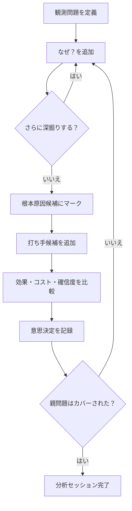

# Canvas 仕様（再設計案）

本ドキュメントは Tipsboard Canvas のゼロベース再設計仕様である。**v0.4.0** 以降は問題の深掘り・根本原因の特定・打ち手の整理に特化した製品として実装されている。実装との差分は §10 を参照。

関連: 実装全体の地図は [`SPEC.md`](./SPEC.md)。現行の永続化・RPC の概要は同 §8.1.2・§9.12。

---

## 1. 目的・非目的・対象ユーザー行動

### 1.1 目的

Canvas は、漠然とした問題を段階的に深掘りし、根本原因を見極め、それに対する打ち手を意思決定するための **問題分析・意思決定ツール** である。

次の流れを支援する。

1. **何が問題か**を明確にする（観測問題の定義）
2. **なぜ起きているのか**を深掘りする（5 Whys / 問題分解）
3. **根本原因の候補**を見極める
4. **打ち手候補**を出す
5. 打ち手を比較し、**実行判断**する

### 1.2 非目的

Canvas は次を主目的としない。

| 非目的 | 理由 |
| --- | --- |
| 自由な無限ボード | 線とノードが増えるほど認知負荷が上がり、分析ワークフローと相性が悪い |
| 汎用ホワイトボード（画像・リンク・メモの自由配置） | PKM のノート編集・KANBAN と役割が重複する |
| プロジェクト管理・タスク実行 | 実行トラッキングは KANBAN やノート側の責務 |
| 自動原因推定・AI によるツリー生成 | 分析の主体はユーザー。AI 連携は Mermaid 外部編集で補助可能とする |

### 1.3 対象ユーザー行動

| 行動 | Canvas が提供する価値 |
| --- | --- |
| 現象を言語化する | ルート問題ノードと `description` で観測事実を記録 |
| 「なぜ？」を繰り返す | `because` エッジと深さ表示で深掘りの進捗を可視化 |
| どこまで掘れば十分か判断する | 根本原因候補のマークとカバー状況の表示 |
| 打ち手を洗い出す | 原因に紐づく Solution ノード |
| どの打ち手を採るか決める | Solution の `decision` 状態と比較用メタデータ |
| 後から構造を見返す | アウトライン・グラフ・Mermaid ソースの三者で同じ構造を読める |

### 1.4 設計原則（製品レベル）

- **作業台として設計する**: 全体俯瞰より、いま掘っている枝の理解を優先する。
- **深さを常に見せる**: 縦位置の暗黙ヒントだけに頼らない。
- **線を減らして読む**: 全エッジ常時強調はしない。
- **接続を信頼できる見た目にする**: ノードと線が別物に見えないこと。
- **意思決定まで記録する**: 分析で終わらせず、採用した打ち手を残す。

---

## 2. 分析ワークフロー

### 2.1 標準フロー



### 2.2 フェーズ定義

| フェーズ | ユーザーの問い | 主な操作 | 完了条件 |
| --- | --- | --- | --- |
| 定義 | 何が起きているか？ | ルート Problem 作成、`description` 記入 | 観測可能な問題文がある |
| 深掘り | なぜそうなっているか？ | `because` で子 Problem 追加 | これ以上掘る必要がないと判断 |
| 特定 | どれが根本原因か？ | `root_cause_candidate` にマーク | 打ち手検討の起点が決まる |
| 打ち手 | 何ができるか？ | `solved_by` で Solution 追加 | 少なくとも 1 候補がある |
| カバー確認 | 上位問題は解けたか？ | 親ツリーのカバー状態を確認 | ルートまでカバー、または未解決が明示されている |

### 2.3 カバー（coverage）ルール

親 Problem は、次のいずれかで「カバー済み」とみなす。

1. **子 Problem がすべてカバー済み**（再帰的）
2. **末端 Problem**（`because` 子がない）で、かつ **少なくとも 1 つの Solution** がある

**v0.4.0 の実装**: 記載した打ち手（Solution）は採用前提とする。UI に意思決定の選択はなく、リンクされた Solution の有無のみでカバー判定する。

### 2.4 複数ルート・共有子

- **複数ルート Problem**（親 `because` なし）を許容する。例: 別観点から同じ事象を捉える。
- **共有子**（複数親から同一 Problem へ `because`）はデータ上許容するが、グラフでは 1 座標に集約される。アウトラインでは `sharedElsewhere` として参照元を示す（`outlineTree.ts` の設計を UI に接続）。

---

## 3. ドメインモデル

### 3.1 エンティティ一覧

| 概念 | 実装形 | 説明 |
| --- | --- | --- |
| Problem | ノード種別 `problem` | 観測問題または深掘りされた原因 |
| Solution | ノード種別 `solution` | 原因に対する打ち手候補 |
| Root Cause Candidate | Problem の **状態** | 独立ノード種別にはしない |
| Decision | Solution の **属性**（スキーマのみ） | Mermaid 互換用。v0.4.0 UI では未使用 |
| because | エッジ種別 | 親 Problem → より深い Problem |
| solved_by | エッジ種別 | Problem → Solution |

**設計判断**: Root Cause を独立ノードにしない理由は、(1) 深掘り途中の Problem と根本原因候補の境界が流動的、(2) ノード種別が増えるとグラフの読み分けが難しくなる、(3) 状態としてマークすればアウトライン・フィルタで十分表現できるため。

### 3.2 Problem ノード

```typescript
interface CanvasProblemNode {
  id: string;
  type: "problem";
  title: string;
  description?: string;
  status: ProblemStatus;
}

type ProblemStatus =
  | "open"                    // 分析中
  | "needs_deeper_analysis"   // まだ深掘りが足りない（任意・手動またはヒューリスティック）
  | "root_cause_candidate"    // 根本原因候補
  | "covered";                // カバー済み（算出または手動確定）
```

| フィールド | 必須 | 説明 |
| --- | --- | --- |
| `title` | はい | 一行要約（グラフ・アウトラインに表示） |
| `description` | いいえ | 観測事実・背景・根拠 |
| `status` | はい（既定 `open`） | 分析・カバー状態 |

**深さ（depth）** は永続化フィールドではなく、`because` グラフから算出する派生値とする（ルートからの最長パス上の位置）。

### 3.3 Solution ノード

```typescript
interface CanvasSolutionNode {
  id: string;
  type: "solution";
  title: string;
  description?: string;
  impact?: "low" | "medium" | "high";
  effort?: "low" | "medium" | "high";
  confidence?: "low" | "medium" | "high";
  decision?: SolutionDecision; // スキーマ互換。既定 accepted。UI なし
}

type SolutionDecision =
  | "accepted"   // 既定・採用前提
  | "undecided"  // 読み込み時 accepted に正規化
  | "rejected"
  | "deferred"
  | "experiment";
```

| フィールド | MVP | 説明 |
| --- | --- | --- |
| `title` | 必須 | 打ち手の要約 |
| `description` | 任意 | 具体案・前提・リスク |
| `impact` / `effort` / `confidence` | 任意 | 比較のための 3 軸（L/M/H）。UI は後続 |
| `decision` | スキーマのみ | v0.4.0 では UI なし。書いた打ち手は採用前提 |

### 3.4 エッジ

```typescript
interface CanvasEdge {
  id: string;
  from: string;
  to: string;
  type: "because" | "solved_by";
}
```

| 種別 | from | to | 意味 |
| --- | --- | --- | --- |
| `because` | `problem` | `problem` | 「親の問題は、子の問題が原因である」 |
| `solved_by` | `problem` | `solution` | 「この原因に対し、この打ち手を検討する」 |

### 3.5 接続制約（構造ルール）

| ルール | 内容 |
| --- | --- |
| R1 | `because` は `problem` → `problem` のみ |
| R2 | `because` で循環を作れない |
| R3 | `solved_by` は `problem` → `solution` のみ |
| R4 | `solved_by` の起点は **末端 Problem**（`because` 子がない）に限定する |
| R5 | 同一 `(from, to, type)` の重複エッジは禁止 |
| R6 | 非末端への `solved_by` はパース・保存は許容するが **警告**（外部 Mermaid 編集用） |

R4 の理由: 中間層に打ち手を付けると「どの原因への対策か」が曖昧になる。中間問題への対策は、深掘りして末端に落とすか、子 Problem を追加してから付ける。

### 3.6 ドキュメント（Canvas ファイル）

```typescript
interface CanvasDocument {
  version: 1;
  nodes: Array<CanvasProblemNode | CanvasSolutionNode>;
  edges: CanvasEdge[];
}
```

1 Canvas ファイル = 1 つの分析セッション（1 テーマ）を想定する。複数ルート Problem を含めてよい。

---

## 4. 画面構成

### 4.1 レイアウト（v0.4.0 実装）

```mermaid
flowchart LR
  subgraph header [Header]
    canvasPicker[Canvas 切替]
    warnings[構造警告]
    saveState[保存状態]
  end
  subgraph main [Main]
    graph[グラフ（メイン）]
    detail[詳細ペイン（選択時のみ）]
  end
  header --> main
```

| 領域 | 幅（目安） | 表示 |
| --- | --- | --- |
| グラフ | 全幅（詳細非表示時） / 残り | 常時 |
| 詳細ペイン | 320px | ノード選択時のみ |


*図: 問題構造グラフ。ノード選択時に右の詳細ペインでタイトル・説明・状態を編集する。*

**設計判断**: グラフを最大限確保するため、詳細ペインはオーバーレイ的に右から出す。アウトラインは v0.4.0 では未実装（`outlineTree.ts` はレイアウト用ユーティリティのみ）。

### 4.2 アウトライン（将来）

当初案の左ペイン。深さと論理構造をテキストツリーで把握する用途。v0.4.0 では未搭載。

| 機能 | 説明 |
| --- | --- |
| ツリー表示 | ルート Problem から `because` / `solved_by` を再帰表示（`buildOutlineForest`） |
| 深さインデント | ネストで深さを表現 |
| 折りたたみ | サブツリー単位で畳む |
| 状態アイコン | 未カバー / 根本原因候補 等 |
| 選択同期 | クリックでグラフ・詳細と選択を同期 |

### 4.3 グラフビュー

**役割**: 因果構造の空間的把握と、ノード・エッジの直接操作。

| 機能 | 説明 |
| --- | --- |
| 深さレーン | 水平ガイドまたはラベル（Depth 0, 1, 2…） |
| ノード | Problem / Solution のカード表示 |
| 接続ポート | ノード辺上の明示的接点からエッジを描画 |
| フォーカスモード | 選択ノードの祖先・子孫・接続 Solution のみ強調 |
| パン・ズーム | 既存と同様 |
| インラインタイトル編集 | ダブルクリック |
| リンクモード | `because` / `solved_by` の手動接続 |

配置は **自動レイアウトのみ**（ユーザー自由配置は MVP 外）。問題は上→下＝深さ、Solution は親 Problem の右側にスタック。

### 4.4 詳細ペイン（ノード選択時）

**役割**: 選択中ノードの文脈と分析記録。未選択時は非表示（グラフが全幅）。

#### Problem 選択時

| セクション | 内容 |
| --- | --- |
| タイトル | 編集可能 |
| 説明 | `description` 編集 |
| 深さ | 算出値表示（例: 「深さ 2」） |
| パンくず | ルート → … → 現在 |
| 状態 | `status` 切替（根本原因候補マーク等） |
| 親問題 | リンク一覧 |
| 深い原因 | `because` 子一覧 + 追加 |
| 打ち手 | `solved_by` 子一覧 + 追加（末端のみ） |

#### Solution 選択時

| セクション | 内容 |
| --- | --- |
| タイトル・説明 | 編集可能 |
| 対象問題 | 親 Problem へのリンク |

閉じる: ヘッダー ×、背景クリック、Escape。

### 4.5 ヘッダー

| 要素 | 説明 |
| --- | --- |
| Canvas 切替・作成・削除 | 現行と同様 |
| ルート問題追加 | 新規観測問題 |
| 構造警告 | `validateCanvasRules` + パース警告 |
| Mermaid ソースを開く | 外部編集・AI 連携 |
| 保存状態 | autosave 表示 |

experimental バッジは残すが、互換性の常時バナーは折りたたみまたは初回のみに縮小する（作業領域確保）。

---

## 5. UX 原則（認知負荷の低減）

### 5.1 深さの可視化

| 手段 | 説明 |
| --- | --- |
| レイヤーガイド | グラフ背景に深さごとの水平帯 |
| 深さバッジ | ノード内に `D0` `D1` … または「観測」「直接原因」等のラベル |
| アウトラインインデント | 主たる深さ表示 |
| パンくず | 詳細ペインでルートからの経路 |
| フィルタ（将来） | 「深さ N まで」「選択から k ホップ」 |

算出: `computeProblemDepths()` — ルート（`because` 親なし）を 0 とし、`because` 方向に +1。複数親は **最大親深さ + 1**。

### 5.2 線の整理

| 原則 | 実装方針 |
| --- | --- |
| デフォルトは控えめ | 非フォーカスエッジは細線・低 opacity |
| フォーカス時 | 選択ノードの祖先・子孫・接続 Solution のエッジのみ強調 |
| 折りたたみ連動 | アウトラインで畳んだサブツリーのエッジは非描画 |
| 交差回避 | 直線のみから **正交ルーティング**（縦→横→縦）へ |
| 混雑時 | リンク次数に応じた **太さ増加は行わない**（現行 `linkDegreeVisualScale` の逆） |
| 種別の分離 | 表示トグル: 原因のみ / 対策のみ（任意） |

### 5.3 接続の見え方

| 要件 | 説明 |
| --- | --- |
| ポート | `because`: 親下辺・子上辺（複数子は辺を等分割） / `solved_by`: 親右辺・子左辺 |
| 線の終端 | ノード境界のポートにスナップ。矢印頭はポート上でノードと重なる |
| レイヤー | エッジはノード背面に隠れないよう、接続部のみ前面描画するか、線を境界まで伸ばす |
| プレビュー | リンクモードのプレビュー線も `edgeAnchor` と同じ起点を使う |
| ハンドル | `?` / 電球ハンドルはポート位置と一致 |

`CanvasEdgeOverNodeHints`（ノード上だけ点線を重ねる回避策）は、正交ルーティングとポート修正後に **廃止** を目標とする。

### 5.4 操作の一本化

| 現行の二重化 | 統一方針 |
| --- | --- |
| `+なぜ？` ボタン vs `?` ハンドル | **子 Problem 自動作成**は `+なぜ？` のみ。ハンドルは **既存ノードへのリンク** 専用、または廃止 |
| 下部ツールバー vs 詳細ペイン | 追加・削除の主導線は **詳細ペイン**。グラフ上は選択と簡易ショートカットのみ |
| エッジツールバー | 付け替え・削除は詳細ペインの「接続」セクションにも出す |

### 5.5 フィードバック

| 状態 | 表示 |
| --- | --- |
| 未カバー末端 Problem | 赤枠またはアイコン（現行 `problemNeedsSolution`） |
| 根本原因候補 | バッジまたは枠色 |
| 採用済み Solution | 緑系チェック |
| ルール違反 | ヘッダー警告 + 該当ノードへジャンプ |
| 削除 | サブツリー削除時は確認ダイアログ |

---

## 6. 永続化

### 6.1 ファイル形式

- パス: `.tipsboard/canvas/<name>.canvas`
- 形式: Mermaid テキスト + Tipsboard メタデータ（**v1 を維持し拡張**）
- ヘッダ: `%% tipsboard-canvas-version: 1`
- 宣言: `flowchart TD` 固定

### 6.2 ノードのシリアライズ（拡張案）

既存:

```text
%% node:p_abc problem
%% description:観測メモ
p_abc["売上が低い"]
```

拡張（メタ行を追加）:

```text
%% node:p_abc problem
%% status:root_cause_candidate
%% description:前月比 -20%
p_abc["新規登録率が低い"]
```

```text
%% node:s_xyz solution
%% decision:accepted
%% impact:high
%% effort:medium
%% confidence:medium
s_xyz["入力項目を削減する"]
```

パーサは未知の `%% key:value` を **警告なく保持**（ラウンドトリップ）するか、`CanvasNode` の拡張フィールドにマップする。

### 6.3 互換性

| 版 | 扱い |
| --- | --- |
| v0.3.12 以前 JSON | 読み込み不可（現行維持） |
| v1 Mermaid（status なし） | 読み込み時 `status: open` を既定。Solution は採用前提 |
| 将来 v2 | 別ヘッダで breaking 変更可。v1 からの import ツールを検討 |

---

## 7. v0.4.0 スコープ

### 7.1 含まれる（v0.4.0 で実装済み）

| # | 機能 |
| --- | --- |
| 1 | Problem / Solution ノード、`because` / `solved_by` |
| 2 | `description` の編集（詳細ペイン） |
| 3 | Problem `status`（`open` / `needs_deeper_analysis` / `root_cause_candidate` / `covered`） |
| 4 | 詳細ペイン（ノード選択時・パンくず・親子一覧） |
| 5 | グラフ: 深さレーン、フォーカス強調、接続ポート、正交ルーティング |
| 6 | 構造ルール検証と警告 |
| 7 | Mermaid v1 拡張シリアライズ（`status` 等） |
| 8 | ノード削除確認 |
| 9 | 打ち手は採用前提（意思決定 UI なし） |

### 7.2 後続

| 機能 | 理由 |
| --- | --- |
| 左アウトライン | 大規模ツリー向け。`outlineTree.ts` は用意済み |
| impact / effort / confidence の UI | スキーマ・Mermaid のみ |
| Solution `decision` の UI | v0.4.0 では採用前提のため不要 |
| 表示フィルタ（深さ k / 原因のみ） | 大規模グラフ向け |
| アウトラインからのドラッグ並べ替え | 優先度付け |
| 複数 Canvas 間リンク | スコープ外 |
| 自由配置・無限ボード | 非目的（v0.3.x JSON 時代は廃止） |
| 画像・ノート埋め込みノード | 非目的 |
| AI 自動ツリー生成 | 非目的 |
| エクスポート（PDF/HTML レポート） | 価値はあるが後続 |

### 7.3 成功指標（定性）

- 5〜15 ノードの分析で、「どの段階まで掘ったか」をユーザーが説明できる
- 線の本数が増えても、選択フォーカスで主要な枝が追える
- エッジがノードに接続されていると一目で分かる
- 末端に打ち手を付ければカバー状態が分かる

---

## 8. 用語集

| 用語 | 定義 |
| --- | --- |
| 観測問題 | `because` 親を持たないルート Problem |
| 深さ | ルートから `because` を辿った段数（派生値） |
| 末端 Problem | `because` 子を持たない Problem |
| 根本原因候補 | これ以上深掘りせず打ち手に進む Problem（`status`） |
| カバー | 子がすべてカバー済み、または末端で Solution あり |
| 打ち手 | Solution ノード |

---

## 9. 未決事項（実装前に確認）

| # | 論点 | 推奨案 |
| --- | --- | --- |
| 1 | `needs_deeper_analysis` を手動のみか自動ヒューリスティックか | MVP は手動のみ |
| 2 | `experiment` をカバーに含めるか | 含めない（検証中は未カバー） |
| 3 | 詳細ペインとグラフのどちらを新規ユーザーの初期フォーカスにするか | 空状態はグラフ中央、1 ノード以上はアウトラインも常時表示 |
| 4 | impact/effort/confidence を MVP に入れるか | スキーマのみ用意し UI は後続でも可 |

---

## 10. 実装状況（v0.4.0）

### 10.1 実装済み

| 領域 | 状態 | 主なファイル |
| --- | --- | --- |
| UI | グラフ + 選択時詳細ペイン | `CanvasView.tsx`, `CanvasGraph.tsx`, `CanvasDetailPane.tsx` |
| `description` | 詳細ペインで編集可 | `CanvasDetailPane.tsx` |
| `status` | 型・Mermaid・詳細ペイン UI | `canvasTypes.ts`, `canvasMermaid.ts`, `CanvasDetailPane.tsx` |
| 深さ | レーン・D{n} バッジ・パンくず | `CanvasGraph.tsx`, `CanvasGraphNode.tsx`, `CanvasDetailPane.tsx` |
| エッジ | ポート分散・正交ルーティング・フォーカス強調 | `graphLayout.ts`, `CanvasGraph.tsx` |
| カバー | Solution の有無で判定（採用前提） | `graphUtils.ts` |
| 削除確認 | サブツリー削除前に確認ダイアログ | `CanvasView.tsx` |
| i18n | `canvas.detail.*` 等 | `locales/ja.ts`, `locales/en.ts` |
| ドキュメント | README・ユーザーガイド・SPEC | 各種 |

主要ファイル:

- [`webview/src/components/canvas/CanvasView.tsx`](../webview/src/components/canvas/CanvasView.tsx)
- [`webview/src/components/canvas/CanvasDetailPane.tsx`](../webview/src/components/canvas/CanvasDetailPane.tsx)
- [`webview/src/components/canvas/CanvasGraph.tsx`](../webview/src/components/canvas/CanvasGraph.tsx)
- [`webview/src/components/canvas/CanvasGraphNode.tsx`](../webview/src/components/canvas/CanvasGraphNode.tsx)
- [`webview/src/lib/canvas/graphLayout.ts`](../webview/src/lib/canvas/graphLayout.ts)
- [`webview/src/lib/canvas/graphUtils.ts`](../webview/src/lib/canvas/graphUtils.ts)
- [`webview/src/lib/canvas/outlineTree.ts`](../webview/src/lib/canvas/outlineTree.ts)（ユーティリティのみ・UI 未接続）
- [`src/shared/canvasTypes.ts`](../src/shared/canvasTypes.ts)
- [`src/shared/canvasMermaid.ts`](../src/shared/canvasMermaid.ts)

### 10.2 後続（未実装）

| 機能 | 備考 |
| --- | --- |
| 左アウトライン | `buildOutlineForest` の UI 接続 |
| impact / effort / confidence の UI | スキーマ・Mermaid シリアライズは用意済み |
| Solution `decision` UI | v0.4.0 では意図的に省略 |
| 表示フィルタ（深さ k / 原因のみ） | 大規模グラフ向け |

### 10.3 テスト

| 対象 | 状態 |
| --- | --- |
| `canvasMermaid.test.ts` | status メタデータ・レガシー decision 正規化 |
| `graphUtils.test.ts` | Solution 有無によるカバー判定 |
| `graphLayout.test.ts` | ポート分割・正交パス |
| `canvasRuleValidation.test.ts` | 構造ルール検証 |
| `canvas.host.test.ts` | Host CRUD |

---

## 改訂履歴

| 日付 | 内容 |
| --- | --- |
| 2026-06-14 | 初版（ゼロベース再設計仕様） |
| 2026-06-14 | v0.4.0 リリースに合わせて §2–§4・§7・§10 を実装反映（グラフ+選択時詳細、意思決定 UI なし） |
| 2026-06-14 | §4.1 にスクリーンショット（`canvas_board.png`）を追加 |
