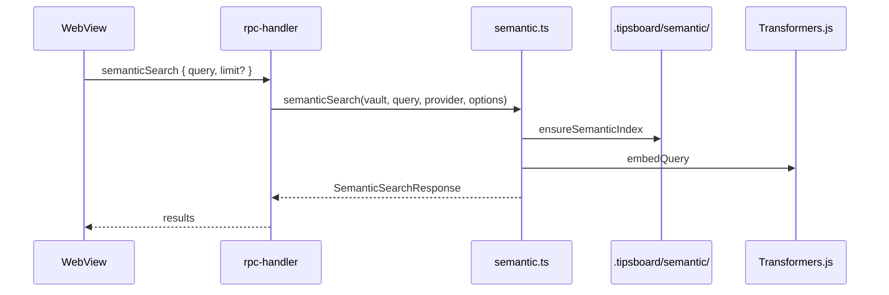
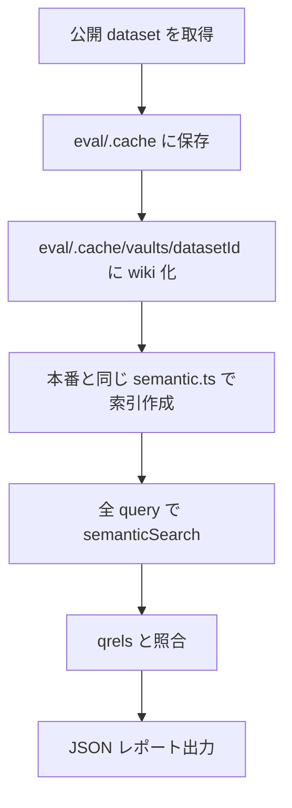

# セマンティック検索の仕様と評価方式

## この文書について

この文書は、Tipsboard for VS Code のセマンティック検索が「どのファイルを、どのように索引化し、どう順位付けしているか」と、「その検索品質を開発時にどう評価しているか」を説明するためのものです。

拡張全体の構成は [`SPEC.md`](./SPEC.md) にあります。この文書では、その中でも `src/host/semantic.ts` と `eval/semantic/` まわりに絞って、コードを読む前に全体像を掴めるように書いています。評価コマンドの短い実行手順だけを確認したい場合は、リポジトリ直下の [`DEVELOPMENT.md`](../DEVELOPMENT.md) を参照してください。

---

## 1. 何をする機能か

セマンティック検索は、単語の完全一致ではなく「意味が近いノート」を探すための検索です。たとえば、ノート本文にクエリと同じ単語がそのまま出てこなくても、embedding のベクトル空間上で近い内容なら候補に出せます。

Tipsboard ではこの処理をすべてローカルで行います。検索対象は選択中の vault root 配下にある Markdown ファイルです。`.tipsboard/`、`.git/`、`node_modules/`、`dist/`、`build/`、`out/` 配下、画像、添付ファイル、KANBAN の JSON、pins の JSON などは検索対象に含めません。外部の検索 API やクラウド推論にも送信しません。

ユーザーが WebView の検索モーダルからクエリを入力すると、WebView は Host 側へ `semanticSearch` RPC を送ります。Host 側では、必要なら vault から索引を作り直し、クエリを embedding して、チャンクごとのスコアを計算します。結果は `path`、`title`、`heading`、`snippet`、`score`、行範囲を含む形で WebView に返します。



通常のヘッダー検索とは別物です。ヘッダー検索や一覧フィルタは WebView 側で行うキーワード検索で、セマンティック検索は Host 側で embedding と索引を使って行います。

---

## 2. 索引はどう作るか

セマンティック検索は、検索のたびに Markdown 全文をそのまま読むのではなく、あらかじめ検索しやすい単位に分けてベクトル化しておきます。この保存済みデータを索引と呼びます。

### 2.1 対象は vault 配下の Markdown

索引作成時は、vault root 配下の Markdown ファイルを再帰的に読みます。たとえば `docs/auth/oauth.md` や `adr/0001-record-architecture-decisions.md` のような既存のフォルダ階層を保ったまま対象にします。`.tipsboard/`、`.git/`、`node_modules/`、`dist/`、`build/`、`out/` 配下は対象外です。

各ファイルからは、本文とファイルの更新時刻・作成時刻を読みます。タイトルは既存の vault 実装と同じく、本文の先頭行から取り出します。

### 2.2 ノートをチャンクに分ける

embedding は長いノート全文を 1 つのベクトルにするより、意味のまとまりごとに分けた方が検索結果を返しやすくなります。そのため、Tipsboard ではノートを「チャンク」に分割します。

まず Markdown の見出しを見ます。`#` から `#####` まで（h1〜h5）を区切りとしてセクションを作ります。h6（`######`）は区切りにしません。コードブロックの中にある `#` は見出しとして扱いません。ファイル先頭から最初の見出しまでの部分は、ノートタイトルを見出しにしたセクションとして扱います。

1 つのセクションが長すぎる場合は、約 1600 文字ごとに分けます。このとき前後の文脈が完全に切れないように、次のチャンクと 200 文字だけ重ねます。つまり長文ノートでは、近い内容が少し重複した複数チャンクになります。

embedding に渡すテキストは、本文だけではありません。vault 相対パス、タイトル、見出し階層も一緒に入れます。本文だけでは何の話題か分かりにくい短い段落でも、フォルダ名、ファイル名、タイトルや見出しを足すことで検索クエリと結びつきやすくするためです。

```text
Path: {vault 相対パスを階層化した文字列}

Title: {ノートタイトル}

Headings: {見出し階層を " > " で連結}

{チャンク本文}
```

各チャンクには `path`、`title`、`heading`、`content`、開始行・終了行、内容ハッシュを持たせます。内容ハッシュは、後で「このチャンクは前回と同じなので再 embedding しなくてよい」と判断するために使います。

### 2.3 索引ファイルの置き場所

作成した索引は vault 内の `.tipsboard/semantic/` に保存します。

- `manifest.json`: 索引のスキーマバージョン、モデル ID、ベクトル次元、チャンク数、作成・更新時刻
- `chunks.json`: 各チャンクのメタデータと本文断片
- `vectors.f32`: 全チャンクのベクトルを Float32LE で連結したバイナリ

ここに保存するのは vault 固有の索引だけです。Hugging Face から取得するモデル本体は vault には置きません。通常は VS Code 拡張の global storage 配下にキャッシュされます。ユーザーが `importedPath` を指定している場合は、その semantic runtime pack を使います。

### 2.4 いつ作り直すか

検索時にはまず `ensureSemanticIndex` が呼ばれます。これは「今の vault に対して使える索引がすでにあるか」を確認する処理です。

既存索引のモデル ID が現在の設定と同じで、チャンク数も同じで、各チャンクの `path` と `hash` も変わっていなければ、その索引をそのまま使います。ノートが増えた、本文が変わった、モデルが変わった、といった場合は再計算が必要になります。

再計算時も、可能なら前回のベクトルを再利用します。同じモデルで同じチャンクが残っている場合、そのチャンクの embedding は作り直しません。変わったチャンクだけをバッチサイズ 8 で embedding します。

`rebuildSemanticIndex` RPC は、差分ではなく全チャンクを embedding し直します。モデル変更後や索引の不整合が疑われるときに使います。

Tipsboard UI（セマンティック検索モーダル）からも手動実行できます。

| 操作 | RPC | 内容 |
| --- | --- | --- |
| **索引を更新** | `updateSemanticIndex` | `ensureSemanticIndex` と同じ差分更新 |
| **索引を完全再構築** | `rebuildSemanticIndex` | 全チャンクを embedding し直す |

差分更新で短縮できるのは「変更の少ない vault」です。初回・大規模変更・モデル変更後は時間がかかります（後述 §2.4.1）。

### 2.4.1 差分更新の限界

チャンク単位の `hash` 比較です。

- ノート本文の編集 → 変わったチャンクだけ再 embedding
- 新規ノート → 増えたチャンクだけ
- 削除されたノート → 索引書き込み時に整理
- **モデル ID 変更** → 既存ベクトルは使わない（完全再構築推奨）
- **チャンク分割ルール変更** → hash が大量に変わり、ほぼフルに近い

---


## 3. 検索時にどう順位付けするか

検索時は、まずクエリ文字列を embedding してクエリベクトルを作ります。その後、索引済みの各チャンクベクトルとの近さを計算し、スコア順に並べます。

スコアリングには `dense` と `hybrid` の 2 モードがあります。

### 3.1 `dense` モード

`dense` はクエリベクトルとチャンクベクトルのコサイン類似度を主なスコアとして使います。

このモードは、単語が完全一致していなくても意味が近い文書を拾えるのが利点です。一方で、固有名詞、短い記号、ファイル名に近い語など、字面の一致が重要な検索では取りこぼすことがあります。

### 3.2 `hybrid` モード

`hybrid` は既定のモードです。dense の意味検索に、BM25 のキーワード検索スコアを混ぜます。BM25 は外部エンジンを使わず、検索のたびにメモリ上で全チャンクに対して計算します。BM25 用の統計は索引ファイルには保存していません。

処理の流れは次の通りです。

1. すべてのチャンクについて dense スコアを計算する。
2. 同じチャンク集合に対して BM25 スコアを計算する。
3. dense と BM25 はスケールが違うため、それぞれ min-max 正規化する。
4. `denseWeight` と `bm25Weight` で重み付き和を取る。
5. 最後に軽量 reranking の特徴量を混ぜる。

既定の重みは `denseWeight = 0.75`、`bm25Weight = 0.25` です。つまり、基本は意味検索を優先しつつ、キーワード一致も少し効かせる設計です。

最終スコアは概念的には次の形です。

```text
最終スコア = 検索本体のスコア * 0.75 + reranking 特徴量 * 0.25
```

`dense` モードでは、検索本体のスコアに生のコサイン類似度を使います。`hybrid` モードでは、正規化済み dense と正規化済み BM25 の混合スコアを使います。

### 3.3 Reranking

検索本体のスコアを計算した後、次の特徴量で順位を補正します。外部 reranker モデルは使わず、索引済みメタデータと本文断片だけで計算します。

- **title exact**: 正規化したクエリがノートタイトルと完全一致する場合に強く上げる。
- **heading overlap**: クエリ語と見出し階層のトークン重複率を見る。
- **phrase overlap**: クエリ全体または隣接語句がタイトル・見出し・本文断片に含まれるかを見る。
- **recency**: チャンクの `updatedAt` を min-max 正規化して少しだけ加える。
- **same-note penalty**: すでに選ばれたノートと同じ `path` の追加チャンクは、選択時に少し減点する。

reranking 特徴量の内訳は、title exact 40%、heading overlap 25%、phrase overlap 25%、recency 10% です。same-note penalty は候補を上から選ぶ段階で適用し、同じノートのチャンクばかりが上位を占めるのを抑えます。

### 3.4 BM25 の日本語トークン化

BM25 は単語単位の一致を見るため、トークン化が必要です。英数字や `_`、`.`、`-` を含む語はそのまま 1 トークンとして扱います。

日本語は空白で単語が分かれていないため、漢字・ひらがな・カタカナの連続部分を文字に分け、隣り合う 2 文字のバイグラムも作ります。たとえば長い日本語語句でも、部分的な一致が BM25 に効くようにするためです。

BM25 のパラメータは `k1 = 1.2`、`b = 0.75` です。

### 3.5 返す結果

スコア計算後、チャンク単位で降順ソートします。同点の場合はタイトル昇順です。`limit` は指定がなければ 20、最大 100 までです。

返却する `snippet` は、チャンク本文の空白を正規化し、長ければ 220 文字程度で切ったものです。結果には `indexedChunkCount` と `modelId` も含めます。UI 側はこれを使って、どのモデル・何チャンクの索引で検索したかを把握できます。

選択中ノートの Related 領域で表示する「近傍ノート」は、この `semanticSearch` をノート本文で実行した結果を WebView 側でノート単位に集約します。自分自身と既存のリンク関連ノート、既定しきい値 `0.45` 未満の弱い候補は除外し、同じ `path` の複数チャンクは最大スコアを採用します。UI では通常のノートカードの中に一致度、ヒット見出し、本文スニペットを表示します。

---

## 4. embedding モデルと設定

embedding は `@huggingface/transformers` の `feature-extraction` pipeline で行います。実行時は `dtype: "q8"` を指定し、量子化されたモデルを使います。出力は `normalize: true` で正規化します。

モデルによって、推奨される pooling や入力 prefix が異なります。そのため、モデル ID の文字列を見てプロファイルを切り替えます。

- `bge-m3` を含むモデルは `cls` pooling を使う。
- `multilingual-e5` を含むモデルは `mean` pooling を使い、クエリに `query: `、文書に `passage: ` を付ける。
- `gte-multilingual` を含むモデルは `cls` pooling を使う。
- 上記以外のモデル ID を指定した場合は、既定のプロファイル（`mean` pooling、prefix なし）にフォールバックします。

索引作成時は `embedDocuments` を使います。検索時は `embedQuery` を使います。e5 系のように query と passage で prefix を変えるモデルでは、この分岐が重要になります。

主な設定は `tipsboard-vscode.semanticSearch.*` です。

- `provider`: `bundled` または `off`。`off` ならセマンティック検索 RPC はエラーになる。
- `modelId`: embedding モデル。設定 UI では `Xenova/multilingual-e5-base`（既定）と `Xenova/bge-m3` から選択。
- `allowRemoteModels`: 既定 **`true`**。キャッシュに無いモデルは Hugging Face Hub から取得。閉域では `false` にする。
- `modelCachePath`: Transformers.js キャッシュの絶対パス（任意）。閉域で `allowRemoteModels: false` のとき、事前配布フォルダを指す。
- `mode`: `dense` または `hybrid`。既定は `hybrid`。
- `denseWeight`: hybrid 時の dense 重み。既定は `0.75`。
- `bm25Weight`: hybrid 時の BM25 重み。既定は `0.25`。
- `importedPath`: 用意済み semantic **runtime** pack の絶対パス（`@huggingface/transformers` 同梱フォルダ。モデル重みではない）。
- `runtimeDownloadBaseUrl`: semantic runtime をダウンロードする場合のベース URL。

コマンド **Tipsboard: Reveal Semantic Model Cache** で、実際に使われるモデルキャッシュフォルダを OS のファイラで開けます。

設定が変わったときは、Host 側の embedding provider cache を破棄します。古いモデルや古い runtime を使い続けないようにするためです。

### オンライン利用（既定）と閉域利用

**オンライン（既定）:** `allowRemoteModels` は `true` のまま。初回の索引/検索で Transformers.js が Hub からモデル重みを取り、global storage の `semantic-models`（または `modelCachePath`）にキャッシュします。runtime も無いときは GitHub からの自動 DL または zip インストールを案内します。

**閉域（推奨）:** GitHub Releases から OS 向け **semantic offline pack**（`tipsboard-semantic-offline-<platform>-<arch>.zip`）をダウンロードし、**Tipsboard: Install Semantic Offline Pack from File...** または Tipsboard 設定の **オフラインパックをインストール** で zip を選びます。runtime と model cache が自動配置され、`allowRemoteModels: false` と `modelCachePath` も設定されます。案内に従い VS Code ウィンドウをリロードしてください。

**閉域（手動・上級）:** runtime と model cache を別々に配布する場合は次をセットします。

| 層 | 設定 |
| --- | --- |
| モデル | `allowRemoteModels: false` + `modelCachePath` に事前配布キャッシュ |
| Runtime | `importedPath` または **Install Semantic Runtime from File**（自動 DL を使わない） |

配布用アーティファクトは **ビルド環境（ネットあり）** で作ります。

```bash
npm run prepare:semantic-offline-pack   # → dist/tipsboard-semantic-offline-<target>.zip（推奨）
npm run prepare:semantic-pack             # → dist/tipsboard-semantic-runtime-*.zip
npm run prepare:semantic-model-cache    # → dist/semantic-model-cache/
```

offline pack zip の中身:

```text
manifest.json                 # kind: tipsboard-semantic-offline-pack
runtime/
  manifest.json
  node_modules/@huggingface/transformers/...
semantic-model-cache/
  Xenova/
    multilingual-e5-base/...
    bge-m3/...
```

`modelCachePath` に指定するのは、**個別モデルのフォルダではなく `semantic-model-cache` の親キャッシュフォルダそのもの**です。たとえばビルド環境で `npm run prepare:semantic-model-cache` を実行すると、次のようなフォルダを配布します。

```text
dist/semantic-model-cache/
  Xenova/
    multilingual-e5-base/
      config.json
      tokenizer.json
      tokenizer_config.json
      onnx/...
    bge-m3/
      config.json
      tokenizer.json
      tokenizer_config.json
      onnx/...
```

閉域 PC では、この `semantic-model-cache` フォルダを任意の場所に置きます。例:

```text
/opt/tipsboard/semantic-model-cache/
/Users/<user>/Tipsboard/semantic-model-cache/
C:\Tipsboard\semantic-model-cache\
```

そのうえで Tipsboard の歯車メニューから:

1. **不足しているモデルを Hugging Face Hub から取得する** をオフにする（`allowRemoteModels: false`）。
2. **モデルキャッシュフォルダ** に上記の `semantic-model-cache` フォルダの絶対パスを入れる（`modelCachePath`）。
3. `modelId` は配布キャッシュに含めたモデルだけを選ぶ。

`modelCachePath` を空にした場合は VS Code 拡張の global storage 配下 `semantic-models` を見に行きます。その場所を使う場合は **Tipsboard: Reveal Semantic Model Cache** で開いたフォルダの中へ、配布した `semantic-model-cache` の中身をコピーしてください。

キャッシュが無い状態で `allowRemoteModels: false` のまま検索すると、モデル読み込み時にエラーになります。Python の `~/.cache/huggingface` とはレイアウトが異なるため、Transformers.js 形式のフォルダをそのまま配布してください。

eval で閉域と同じ条件を試すとき: `TIPSBOARD_SEMANTIC_EVAL_ALLOW_REMOTE_MODELS=0` または `--model-cache-dir dist/semantic-model-cache`（`--allow-remote-models` は付けない）。

評価や比較で使う候補モデルとしては、設定 UI の 2 モデルに加え、eval では `onnx-community/gte-multilingual-base` も試せます。

---

## 5. なぜ評価が必要か

セマンティック検索は、単体テストだけでは品質を判断しにくい機能です。コードが正しく動いていても、モデルやチャンク化、スコアの混ぜ方によって「欲しいノートが上位に来るか」は大きく変わります。

そのため、開発用に `eval/semantic/` という評価導線を用意しています。この評価は CI には入れません。実際の Transformers.js runtime を使い、初回はモデルやデータセットをダウンロードし、CPU 性能にも左右されるためです。

評価コードやキャッシュは VSIX にも含めません。`.vscodeignore` で `eval/**`、`vitest.semantic-eval.config.mts`、`tsconfig.semantic-eval.json` を除外しています。これは製品機能ではなく、開発時に検索品質を確認するための道具です。

`vitest.semantic-eval.config.mts` では `testTimeout: 0`（無制限）にしています。MLDR 既定（corpus 5,000 件・全クエリ）では CPU 上で 10 分を超えることが普通です。短く試すときは `--limit-queries` や `--limit-docs` を使います。

---

## 6. 評価はどう動くか

評価では、公開されている retrieval dataset を使います。人手で「このクエリにはこの文書が正解」と Tipsboard 独自に作るのではなく、dataset が持っている qrels を ground truth として使います。qrels には、クエリ ID、関連文書 ID、関連度スコアが入っています。

評価の流れは次の通りです。



まず Hugging Face の datasets-server API から corpus、queries、qrels を取得します。取得したデータは `eval/.cache/{datasetId}.json` にキャッシュします。再取得したい場合は `npm run eval:semantic -- --refresh-dataset` を使います。

キャッシュは「一度取った最大サイズ」が残ります。以前に 5,000 件で取った JSON があると、`--limit-docs 500` だけでは HF に行かず、読み込み後に 500 件へ切り詰めます（ログに `Loaded dataset cache with fetch limits` と出ます）。逆にキャッシュが 500 件しかないのに 5,000 件欲しいときは、キャッシュ削除か `--refresh-dataset` が必要です。索引のチャンク数は評価 vault 内の Markdown 全体から決まるため、文書数が多いと embedding だけで数時間かかることがあります。

次に、corpus の各文書を Tipsboard のノート形式へ変換します。1 文書を 1 つの `.md` ファイルにし、`eval/.cache/vaults/<datasetId>/pages/` に書き出します。評価のたびにこの vault は作り直されますが、場所は常に同じです。

生成する Markdown は単なる dataset dump ではなく、Tipsboard で開いたときに wiki として読めるように整形します。先頭行は Tipsboard のタイトル抽出に合わせたプレーンタイトルのままにし、その下に `# Overview`、`## Summary`、`### Body`、本文内の短い節見出しから作る `#### ...`、`#### Related Notes`、`##### Dataset Metadata` を配置します。関連ノートは qrels で同じ query の relevant document として並ぶ文書、または本文中でタイトルが言及されている文書から作り、Tipsboard の内部リンク記法 `[Title]` で接続します。

```markdown
{タイトル}

# Overview

## Summary

...

### Body

...

#### Related Notes

- [関連ノート]

##### Dataset Metadata

- Dataset: ...
- Source URL: ...
- Document ID: {doc.id}
```

この vault に対して `rebuildSemanticIndex` を実行し、本番と同じ `semantic.ts` の経路で索引を作ります。その後、dataset の全クエリで `semanticSearch` を実行し、返ってきた `path` を元の document ID に戻して qrels と比較します。評価後も vault は `eval/.cache/vaults/` に残るので、Tipsboard でそのフォルダを開けば semantic 検索の感触を確認できます。

評価はチャンク単位ではなく文書単位です。検索結果はチャンクとして返りますが、同じ文書から複数チャンクが出る可能性があります。そのため、vault 相対パスから document ID に変換したあと、同じ document ID は最初の出現だけを採用します。

---

## 7. 評価 dataset の使い分け

既定は `jmteb-lite-mldr` です。日本語の長文 retrieval で、見出しと本文が長いノートが多く、Tipsboard の実利用に近い条件です。Hugging Face への負荷を避けるため、初回取得は **corpus 5,000 件まで**（全 10,000 件の半分）が既定です。全件が必要なら `npm run eval:semantic -- --dataset mldr --full-dataset` を使います。取得後は `eval/.cache/jmteb-lite-mldr.json` にキャッシュされ、2 回目以降は HF に再アクセスしません。

`jmteb-lite-mintaka` は評価対象から外しています。文書がエンティティ名 1 行中心で、Tipsboard の wiki ノート検索や体感確認から大きく外れるためです。

英語の小さな比較用として `beir-scifact` も用意しています。科学 claim retrieval の dataset で、日本語 Wiki 検索の主評価ではありませんが、モデルや hybrid の挙動を英語で確認する用途に使えます。

---

## 8. 評価指標の意味と解釈

評価は「dataset の各クエリに対し、Tipsboard と同じ semantic 検索を走らせ、返ってきた順位が qrels（正解文書と関連度）にどれだけ近いか」を数値化したものです。検索結果はチャンク単位ですが、同じ文書 ID は先頭の出現だけを採用し、**文書単位の top-K** としてスコアを計算します（実装は `eval/semantic/semantic-eval.test.ts`）。

既定の K は 10 です（ログやレポートでは `@10`）。`TIPSBOARD_SEMANTIC_EVAL_TOP_K` または CLI の `--top-k` で変更できます。

### レポート `summary` の各フィールド

JSON レポート（例: `eval/.cache/reports/semantic-eval-jmteb-lite-mldr-*.json`）の `summary` は、全クエリの平均（レイテンシの p95 だけはクエリ間の 95 パーセンタイル）です。

| フィールド | 意味 | 値の範囲 |
| --- | --- | --- |
| `ndcgAtK` | 順位の質（関連度の高い文書が上位にあるか） | 0〜1（高いほど良い） |
| `recallAtK` | 正解文書のうち top-K に入った割合 | 0〜1（高いほど良い） |
| `mrrAtK` | 最初の正解の順位の良さ | 0〜1（高いほど良い） |
| `averageQueryLatencyMs` | 1 クエリあたり検索時間の平均 | ミリ秒（小さいほど良い） |
| `p95QueryLatencyMs` | 遅いクエリの目安（上位 5% 側） | ミリ秒（小さいほど良い） |

同じファイルのルートには、比較の前提となる `modelId`、`documentCount`、`queryCount`、`indexedChunkCount`、`indexBuildMs` なども入ります。モデル比較では **dataset・文書数・クエリ数・mode・top-K を揃えたうえで** `summary` だけを見比べます。

### Recall@K（`recallAtK`）

**意味:** そのクエリで「関連あり」とされる文書のうち、検索 top-K に何割含まれたか。

**計算のイメージ:** 関連文書が 4 件あり、top 10 のうち 2 件が正解なら、そのクエリの recall は `2/4 = 0.5`。クエリごとの値を平均したものが `recallAtK` です。

**解釈:** 「正解の取りこぼし」に敏感な指標です。複数の関連ノートがあり、一部しかヒットしないときは recall だけが伸び悩みます。MLDR では qrels が 1 文書のクエリも多く、その場合は「その 1 件が top-K に入ったか」にほぼ帰着します。

### MRR@K（`mrrAtK`）

**意味:** Mean Reciprocal Rank。各クエリで **最初に現れた正解文書** の順位の逆数を取り、クエリ間で平均したもの。

**計算のイメージ:** 1 件目が正解なら `1.0`、2 件目なら `0.5`、10 件目なら `0.1`。top-K に正解が無ければ `0`。

**解釈:** 「ユーザーが最初に目にする結果」に近いざっくり指標です。1 件でも上位に正解が出れば高くなります。正解が 2 位・3 位に沈んでいると、recall は高くても MRR は低くなります。

### nDCG@K（`ndcgAtK`）

**意味:** Normalized Discounted Cumulative Gain。top-K の並びが、関連度の高い文書ほど上にある理想順にどれだけ近いか。

**計算のイメージ:** 各順位に qrels の関連度スコアを載せ、上位ほど重みを大きくした DCG を求めます。それを「関連度の降順で並べたときの DCG（ideal DCG）」で割って 0〜1 に正規化します。実装では `2^relevance - 1` 形式の DCG を使っています。MLDR の多くの qrels は関連度 `1` のみなので、実質的には「正解が上位にあるか」の順位品質を見ることが多いです。

**解釈:** recall が「入ったか」、MRR が「最初の正解の順位」、nDCG が「並び全体の妥当性」に近いです。関連度に差がある dataset（例: BEIR）では nDCG の差が特に意味を持ちます。

### レイテンシ（`averageQueryLatencyMs` / `p95QueryLatencyMs`）

**意味:** 索引構築後、クエリ embedding とスコアリングだけの時間（`indexBuildMs` は含まない）。

**解釈:** モデルや hybrid 変更で `ndcgAtK` が上がっても、p95 が大きく伸びる場合は製品体験として別途判断が必要です。評価はローカル CPU 上の Transformers.js なので、実際の VS Code 環境や vault サイズと数値は一致しませんが、**相対比較**（同じマシン・同じ条件での Before/After）には使えます。

### 具体例での読み方

次のような `summary` があるとします（500 文書・8 クエリ・multilingual-e5-base・dense の一例）。

```json
"ndcgAtK": 0.4397,
"recallAtK": 0.6250,
"mrrAtK": 0.3792,
"averageQueryLatencyMs": 299.7,
"p95QueryLatencyMs": 552.3
```

読み方の例:

- **recall 0.625:** クエリ平均で、関連文書の約 62.5% が top 10 に入っている（複数正解クエリでは「一部だけヒット」もこの値に反映される）。
- **MRR 0.38:** 最初の正解は平均しておおよそ 2〜3 位付近（完全に 1 位ばかりではない）。
- **nDCG 0.44:** 並びの質は中程度。正解は出るが上位への寄せが不十分なクエリが混ざっているイメージ。
- **クエリ数 8:** 文書サブセットに合わせて qrels が切り落とされた場合、件数が少なくなります。**指標のブレが大きい**ので、モデル比較は `--limit-queries` を揃え、可能なら 50 クエリ以上で見ることを推奨します。

3 指標の関係の目安:

| パターン | よくある意味 |
| --- | --- |
| recall 高・MRR 低 | 正解は top-K に入るが順位が下位 |
| recall 低・MRR 高 | 正解は少ないが、当たったクエリではかなり上位 |
| nDCG が recall より低い | 正解はあるが順位が理想的でない |
| 3 つとも低い | 検索が qrels と大きくずれている |

### クエリ別（`queries` 配列）

各要素には `text`（クエリ）、`relevantDocIds`、`rankedDocIds`、クエリ単位の `ndcg` / `recall` / `reciprocalRank`（MRR の元）、`latencyMs` があります。`summary` だけでは分からない失敗例（正解 doc が索引に無い、チャンクは当たるが文書 ID がずれる、など）は、ここを見て原因を切り分けます。

---

## 9. レポートに残すもの

評価が終わると、JSON レポートを `eval/.cache/reports/` に出力します。ファイル名は `semantic-eval-{datasetId}-{timestamp}.json` です。毎回の最新結果は `latest.json` にもコピーします。別の場所に出したい場合は `TIPSBOARD_SEMANTIC_EVAL_REPORT_PATH` を使います。

レポートには、実行条件として dataset ID、モデル ID、検索モード、dense/BM25 の重み、top-K を入れます。また、文書数、クエリ数、索引チャンク数、索引作成時間（`indexBuildMs`）も残します。指標の意味と読み方は [§8](#8-評価指標の意味と解釈) を参照してください。

`queries` には各クエリごとのテキスト、関連 document ID、検索で返った document ID、クエリ別スコア、レイテンシを入れます。これにより、「どのクエリで外しているか」「モデル変更で遅くなったのか」を後から追えます。

### Tipsboard で体感確認する場所

環境変数は不要です。`npm run eval:semantic` を実行すると、vault は次の場所にできます。

| dataset | vault のパス |
| --- | --- |
| 既定 `jmteb-lite-mldr` | `eval/.cache/vaults/jmteb-lite-mldr/` |
| `beir-scifact` | `eval/.cache/vaults/beir-scifact/` |

VS Code で上記フォルダを開き、Tipsboard を起動します。評価実行時に `.tipsboard/semantic/` も作られるため、そのまま wand から semantic 検索を試せます。

---

## 10. 主な実行方法

評価は `scripts/eval-semantic.cjs` 経由で実行します。`npm run` のあとに `--` を付けて CLI 引数を渡します（環境変数よりこちらを推奨）。

```bash
npm run eval:semantic
npm run eval:semantic -- --model-cache-dir dist/semantic-model-cache
npm run eval:semantic -- --help
```

eval も既定で Hub からモデルを取得できます。閉域と同じ条件で試すときは `prepare:semantic-model-cache` の出力を `--model-cache-dir` に指定し、必要なら `TIPSBOARD_SEMANTIC_EVAL_ALLOW_REMOTE_MODELS=0` を付けます。

実行時間の目安: 初回は HF 取得とモデル DL も含みます。MLDR 既定は 1 時間前後かかることもあります（Vitest タイムアウトは無効）。スモークなら `--limit-queries 50 --limit-docs 500` など。

dataset を変える例:

```bash
npm run eval:semantic -- --dataset mldr
npm run eval:semantic -- -d jmteb-lite-mldr
npm run eval:semantic:mldr
```

エイリアス: `mldr`（既定）、`scifact`。

モデルや hybrid の例:

```bash
npm run eval:semantic -- --model Xenova/bge-m3 --dataset mldr
npm run eval:semantic -- --mode hybrid --dense-weight 0.7 --bm25-weight 0.3
```

本文型 dataset で vault を作り、Tipsboard で開く流れ:

```bash
npm run eval:semantic -- --dataset mldr
```

→ `eval/.cache/vaults/jmteb-lite-mldr/` を VS Code で開く。

複数モデル比較:

```bash
npm run eval:semantic:models
npm run eval:semantic:models -- --dataset mldr
```

CI やスクリプト向けに `TIPSBOARD_SEMANTIC_EVAL_*` 環境変数も引き続き使えますが、手元では CLI 引数で足ります。

---

## 11. 既知のベースライン

旧 baseline として `jmteb-lite-mintaka` の数値は `eval/reports/v0.3.0_ss_report.md` に残していますが、現在の評価対象からは外しています。今後の baseline は `jmteb-lite-mldr` または `beir-scifact` で取り直します。

---

## 12. Reranker の扱い

`eval/semantic/reranker.ts` には reranker 候補のメモがあります。例として `BAAI/bge-reranker-v2-m3` や `cross-encoder/ms-marco-MiniLM-L-6-v2` を挙げています。

本番検索には §3.3 の軽量 reranking を組み込んでいます。ただし、ここで挙げている外部 reranker モデルはまだ本番経路には接続していません。`TIPSBOARD_SEMANTIC_EVAL_RERANKER` を指定した場合も、現状は外部 reranker の指定を記録するだけです。導入する場合は、まず Transformers.js / ONNX での実行可否、速度、メモリ使用量、日本語性能を別途検証する必要があります。

---

## 13. 関連ソース

検索の中心は `src/host/semantic.ts` です。ここにチャンク分割、索引読み書き、embedding、dense/hybrid スコアリング、BM25、snippet 作成がまとまっています。

設定読み取りは `src/host/semanticSettings.ts`、provider の作成とキャッシュは `src/host/semanticProviderFactory.ts` と `src/host/semanticRuntime.ts`、RPC の接続は `src/bridge/rpc-handler.ts` にあります。

評価側は `eval/semantic/` 配下です。dataset 定義は `datasets.ts`、Hugging Face からの取得は `importDataset.ts`、一時 vault 生成は `seedVault.ts`、評価本体は `semantic-eval.test.ts`、レポート出力は `report.ts`、進捗表示は `progress.ts` です。モデル比較の入口は `scripts/eval-semantic-models.cjs` です。

---

## 14. 更新履歴

- 2026-05-23: 初版。セマンティック検索の本番仕様と開発用評価方式を文章ベースで整理。
