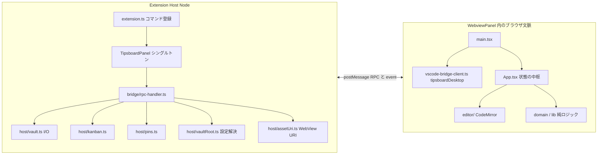

# Tipsboard for VS Code 開発仕様書（現行実装）

## この文書の読み方

- **目的**: コードを読み込まなくても、**何のための拡張か**、**どの技術境界で何をしているか**、**変更するときどこを触るか**を短時間で把握できること。
- **正（normative）の分割**:
  - **本文書**: VS Code 拡張としてのプロセス構成、設定、Bridge、Host のファイル I/O、WebView の状態設計、ビルド。
  - **Editor 共通仕様**: ノートの意味・Markdown / Tipsboard 記法・KANBAN の意味論は `tipsboard-editor/docs_wiki/CURRENT_SPEC.md` を正とする（VS Code 版も同じ `.md` と `.tipsboard/*.json` を使う）。
- **更新方針**: 挙動の「意図」が変わったら本書を直す。ロードマップより **今のコードの事実** を優先する。

---

## 1. なぜこの拡張があるか（製品目的）

Tipsboard は **ローカルフォルダ（vault）だけ**で動く Markdown ベースの PKM（Personal Knowledge Management）である。**アカウントやクラウド同期に依存せず**、ファイルは普通の `.md` と画像・設定 JSON としてディスクに残る。

**VS Code 版の狙い**は次の通り。

1. **開発・執筆・メモを IDE 内で完結**させる。別アプリ（Electron 版 Editor）を開かなくても、同じ vault を編集できる。
2. **Editor とデータ互換**を保つ。`pages/`、`.tipsboard/kanban.json`、`.tipsboard/pins.json`、`assets/images/` などのレイアウトを共有し、**同一フォルダを Editor と VS Code から交互に開いてよい**。
3. **WebView ではファイルシステムに触れない**という VS Code のセキュリティモデルに従い、その分 **Extension Host に I/O とパス検証を集約**する。
4. UI は Editor と同系の **React + CodeMirror** を再利用できるよう、`window.tipsboardDesktop` という **薄いデスクトップ API シム**の背後で RPC を隠す。

`package.json` の説明文どおり、機能の要約は「vault 上のノートグリッド、バックリンク付きエディタ、KANBAN、Mermaid・数式、画像、プレーンファイル」である。

---

## 2. 全体アーキテクチャ（1 枚の見取り図）



- **Host** は `fs`・ダイアログ・`vscode.Uri`・`asWebviewUri` だけが触れる「信頼境界」。
- **WebView** は `acquireVsCodeApi().postMessage` だけが Host へ届く。DOM・CodeMirror・React はすべてここ。

---

## 3. リポジトリ内の責務配置（どこに何があるか）

| 領域 | パス（`tipsboard-vscode/` 以下） | 役割 |
| --- | --- | --- |
| 拡張エントリ | `src/extension.ts` | `activate` でコマンド登録、設定変更でパネルに通知。 |
| パネル | `src/panel/TipsboardPanel.ts` | `WebviewPanel` 生成、HTML/CSP、`localResourceRoots`、メッセージ受信 → `handleRpcInbound`。 |
| RPC | `src/bridge/protocol.ts`, `rpc-handler.ts` | メッセージ形と `method` ディスパッチ。 |
| Vault I/O | `src/host/vault.ts` | スナップショット読み書き、ノート CRUD、画像インポート、JSON import/export。 |
| KANBAN | `src/host/kanban.ts` | `.tipsboard/kanban.json` の読み書きとドメイン操作。 |
| ピン | `src/host/pins.ts` | `.tipsboard/pins.json`。 |
| Vault 解決 | `src/host/vaultRoot.ts` | ワークスペース + 設定から絶対パスを決定、フォルダピッカー。 |
| アセット URI | `src/host/assetUri.ts` | `assets/images/` の相対パスを WebView 用 URI に限定変換。 |
| 共有型 | `src/types/editor.ts` | Host 側 TypeScript 型（`VaultSnapshot` など）。WebView 側は `webview/src/types` で同様。 |
| WebView エントリ | `webview/src/main.tsx` | `process-shim` → **`vscode-bridge-client` を先に import**（`window.tipsboardDesktop` 注入）→ i18n/CSS → `App` マウント。 |
| Bridge クライアント | `webview/src/vscode-bridge-client.ts` | RPC Promise、`prefetchAssets` / `ensureVaultImageUrl`、外部ブラウザ `openExternalInHost`。 |
| UI 中枢 | `webview/src/App.tsx` | `VaultSnapshot` を React 状態の中心に持つ。一覧 / エディタ / KANBAN / ガイド / メニュー。 |
| エディタ | `webview/src/components/NoteEditor.tsx`, `webview/src/editor/` | CodeMirror 初期化、保存プラグイン、装飾、リンク、画像ドロップ。 |
| グラフ・検索 | `webview/src/lib/noteIndex.ts`, `searchNotes` 等 | メモリ上のリンクグラフ、補完候補、タグ。 |
| ドメイン | `webview/src/domain/` | タイトル正規化、リンク抽出など（Editor と思想を揃えた純関数群）。 |
| ユーザーガイド | `webview/src/user-guide/` | 同梱 Markdown 相当の長文（日英）。 |
| Host ビルド | `tsconfig.extension.json` | `src` → `dist/extension/`（CommonJS）。 |
| WebView ビルド | `webview/vite.config.ts` | 単一 ES バンドル → `dist/media/webview.js` + `webview.css`。 |

---

## 4. ライフサイクルとシングルトンパネル

### 4.1 起動

- `activationEvents` は **`onCommand:tipsboard-vscode.open` のみ**。拡張本体はコマンド実行までロードされない。
- `Tipsboard: Open` で `TipsboardPanel.render(context)` が呼ばれる。

### 4.2 パネルの単一性

- `TipsboardPanel.current` に **開いているパネルが最大 1 つ**保持される。
- 既に存在する場合は **`reveal(activeEditorColumn)`** のみ。新規 `createWebviewPanel` は作らない。
- `onDidDispose` で `current` を `undefined` に戻す。

### 4.3 隠れたタブでの状態

- `retainContextWhenHidden: true` のため、タブを切り替えても **WebView 内の JavaScript 状態（React）が維持**される。

### 4.4 Vault 変更の通知（Host → WebView）

次のとき `TipsboardPanel.notifyVaultChanged` が呼ばれうる。

- **設定** `manualVaultPath` / `vaultFolder` の変更（`onDidChangeConfiguration`）。
- **コマンド** `Tipsboard: Select Vault Folder`（フォルダ選択後に `resolveVaultFsPath` で再評価）。

処理内容:

1. `setVaultRoots(vaultFsPath)` で `localResourceRoots` を `[extensionUri, vaultUri]` に更新。
2. `postMessage` で `{ source: "tipsboard-vscode-host", kind: "event", event: "vault-root-changed" }`。

WebView の `App.tsx` はこれを受けて **`getSnapshot()` を再度叩く**。また `snapshot.vaultPath` が変わったとき **`clearTipsboardResolvedAssetCache()`** で画像 URI キャッシュを捨てる（別 vault で同じ相対パスが衝突するのを防ぐ）。

---

## 5. Vault パス解決（設定とワークスペース）

`resolveVaultFsPath()`（`src/host/vaultRoot.ts`）の**決定順は固定**で、上から試す。

1. **`tipsboard-vscode.manualVaultPath`**（trim 後非空）→ その文字列を絶対パスとして採用（**単一フォルダ WS でもワークスペースより優先**。UI から vault 切り替えが必ず反映されるようにするため）。
2. **ワークスペースフォルダが 1 つだけ** → その `uri.fsPath`。
3. **マルチルート** かつ **`tipsboard-vscode.vaultFolder`** が非空  
   - 絶対パスならそのまま。  
   - そうでなければ、フォルダの **表示名**または **fsPath との一致**で最初のヒット。
4. 上記いずれでも決まらない → `undefined`（**vault 未選択**）。

`manualVaultPath` の永続化は **`ConfigurationTarget.Global`**（`persistManualVaultPath`）。マルチマシンで共有したい場合は VS Code の設定同期の対象になる。

---

## 6. WebView パネルの技術仕様

### 6.1 定数

| 項目 | 値 |
| --- | --- |
| `viewType` | `tipsboard-vscode.main` |
| タブタイトル | `Tipsboard` |
| 読み込むスクリプト | `dist/media/webview.js`（`asWebviewUri`） |
| スタイル | `dist/media/webview.css` |

### 6.2 生成される HTML

`TipsboardPanel.buildHtml()` が **文字列で HTML 全文**を返す。

- **CSP**: `default-src 'none'`、`script-src` に nonce、`style-src` に `cspSource` と `'unsafe-inline'`、`img-src` に `cspSource` と `http:` `https:` `data:`、`font-src` に `data:`、`worker-src` に `blob:`。
- **nonce**: 32 文字の英数字ランダム。`script` タグに `nonce="..."` を付与。
- **目的**: WebView 内スクリプトの実行を制限しつつ、バンドル JS・フォント・リモート画像（Markdown）を許容する。

### 6.3 `localResourceRoots`

- **拡張ルート**は常に含める（バンドル CSS/JS）。
- **vault ルート**は `getSnapshot` / `selectFolder` のたびに `setVaultRoots` で追加。これにより **`asWebviewUri(file(vault + relative))`** で **vault 内ファイル**を WebView から読める（主に `assets/images/`）。

---

## 7. Bridge（RPC）仕様

### 7.1 形（プロトコル）

**要求（WebView → Host）** — `src/bridge/protocol.ts` の `RpcInbound`:

- `source`: 常に `"tipsboard-vscode"`
- `kind`: 常に `"rpc"`
- `id`: ユニーク文字列（WebView は `crypto.randomUUID()`）
- `method`: 下記の識別子
- `payload`: 任意（JSON 直列化可能な構造に限定する実装）

**応答（Host → WebView）** — `RpcOutbound`:

- `source`: `"tipsboard-vscode-host"`
- `kind`: `"rpc-result"`
- `id`: 要求と同じ
- `ok`: boolean
- `result` / `error`: 成功時・失敗時

WebView（`vscode-bridge-client.ts`）は `ok === false` で **`Error` reject**。`pending` Map で id と Promise を対応付け。

### 7.2 イベント（RPC 以外）

| フィールド | 例 |
| --- | --- |
| `source` | `tipsboard-vscode-host` |
| `kind` | `event` |
| `event` | `vault-root-changed` |

RPC 応答リスナは `kind === "rpc-result"` のみ処理し、イベントは無視する。

### 7.3 `window.tipsboardDesktop`（WebView から見た API）

`webview/src/global.d.ts` に型がある。**実体は `vscode-bridge-client.ts` の `wireDesktop()`** が `main.tsx` より先にロードされて付く。

| メンバー | 振る舞い（現行） |
| --- | --- |
| `getSnapshot` | RPC `getSnapshot` |
| `selectFolder` | RPC（フォルダピッカー + 設定保存の場合あり） |
| `createNote` / `saveNote` / `deleteNote` / `setNotePinned` | 各 RPC |
| KANBAN 一式 | 各 RPC、戻りは基本的に **更新後の `VaultSnapshot`** |
| `exportJson` / `importJson` | ダイアログ + I/O |
| `importImages` | パス配列（絶対 or vault 相対）からコピー |
| `importImageBuffers` | ドラッグ＆ドロップ等。`Uint8Array` を **number 配列**に展開して RPC（構造化クローンの都合） |
| `prefetchAssets` | `resolveAssetUris` の結果を **メモリ Map にキャッシュ** |
| `resolveAssetUrl` | **同期だがキャッシュヒット時のみ**文字列。初期は空 |
| `getPathForFile` | **常に `""`**（Electron 専用 API のスタブ） |
| `onOpenFind` / `onFindNext` / `onFindPrevious` | **空の unsubscribe を返すだけ**（VS Code メニュー未接続） |

**開発上の意味**: Editor 由来の `NoteEditor` / CodeMirror は `onOpenFind` 等にフックするが、VS Code 版では **CodeMirror の検索パネル（`@codemirror/search`）がローカルに完結**する。

### 7.4 RPC メソッドと Host 実装の対応表

vault 未選択時、**`getSnapshot` と `selectFolder` を除き**概ね `Error: Vault folder is not selected`。

| method | payload 型（要旨） | result（要旨） | 備考 |
| --- | --- | --- | --- |
| `getSnapshot` | なし | `VaultSnapshot` | 併せて `panel.setVaultRoots(vaultPath)` |
| `selectFolder` | なし | `VaultSnapshot` | キャンセル時は現在の `resolveVaultFsPath()` で `readVault` |
| `createNote` | string | `{ notePath, snapshot }` | |
| `saveNote` | `{ path, body }` | `{ notePath, note: NoteSummary }` | タイトル stem 変化でリネーム可 |
| `deleteNote` | string | `VaultSnapshot` | |
| `setNotePinned` | `{ path, pinned }` | `VaultSnapshot` | |
| `createKanbanBoard` | string | `VaultSnapshot` | |
| `updateKanbanBoard` | `{ boardId, name? }` | `VaultSnapshot` | |
| `deleteKanbanBoard` | string | `VaultSnapshot` | |
| `createKanbanColumn` | `{ boardId, name }` | `VaultSnapshot` | |
| `updateKanbanColumn` | `{ columnId, name?, position? }` | `VaultSnapshot` | |
| `deleteKanbanColumn` | string | `VaultSnapshot` | |
| `moveKanbanNote` | `{ boardId, notePath, toColumnId, position? }` | `VaultSnapshot` | |
| `exportJson` | なし | boolean | Save ダイアログ、キャンセルで `false` |
| `importJson` | なし | `VaultSnapshot` | Open ダイアログ |
| `importImages` | string[] | `ImportedImage[]` | |
| `importImageBuffers` | `{ name, data: number[] }[]` | `ImportedImage[]` | |
| `resolveAssetUri` | string | string | 不正パスは `""` |
| `resolveAssetUris` | `{ paths }` | `Record<string,string>` | |
| `openExternal` | `{ uri }` | undefined | **http/https のみ** `openExternal` |

---

## 8. Host 側ファイル仕様（ディスク上の真実）

### 8.1 ディレクトリツリー（慣例）

```
vault/
  pages/*.md           … ノート（フラット。サブフォルダなし）
  assets/images/       … インポート画像（WebView 表示許可パス）
  .tipsboard/
    kanban.json
    pins.json
```

### 8.2 ノートパスの検証

`assertSafeRelativePath`（`vault.ts`）: 正規化後に **`pages/単一ファイル.md`** の形式以外は拒否。`..` や絶対パス禁止。

### 8.3 タイトル・ファイル名

- **タイトル**は本文 **先頭行**（`extractTitle`）。
- **保存時**、先頭行から stem を作り、**既存ファイル名と異なればリネーム**（衝突時は `stem (2).md` のようにユニーク化）。Editor の §8 系仕様に整合。
- リネーム時、**KANBAN** の `note_path` と **pins** のパスを **パッチ**する。

### 8.4 `readVault` の正規化

- `pages/` を列挙し、各ファイルを `NoteSummary` に。**読めないエントリはスキップ**。
- ソート: **`updatedAt` 降順**、同値なら **タイトル昇順**。
- **KANBAN**: 存在しないノートを指すカードを削除し、JSON が変われば保存。
- **pins**: 存在しないパスを剪定し、JSON が変われば保存。
- **表示順**: `pins` に登録されたパスを **`reorderNotesWithPins`** で先頭に並べ、残りはソート順。

### 8.5 画像インポート

- 拡張子: **`.png`, `.jpg`, `.jpeg`, `.gif`, `.webp`** のみ。
- 保存名: **`assets/images/img_<uuid><ext>`**。
- `importImages`: ソースは **絶対パス**または **vault からの相対**（`..` 混入はスキップ）。実ファイルのみコピー。
- 戻り値 `ImportedImage`: `relativePath` と、挿入用 **``** 形式の `markdown`。

### 8.6 アセット URI

`assetPathAllowed`: 正規化後 **`assets/images/` プレフィックス**のみ。`toAssetWebviewUri` は検証失敗時 `null` → RPC は空文字またはキー省略。

### 8.7 JSON export / import

- **export**: `schemaVersion: 1`、`project` 名、`exportedAt`、`pages` 配列（各ノートの title, normalized_title, body, 日時）。`deleted_at: null` フィールドを含む形（`ExportPage` 型）。
- **import**: `schemaVersion` が 1 で `pages` が配列でなければ例外。`deleted_at` が付いたページはスキップ。既存ノートは **`normalized_title` 一致で上書き**、なければ `allocateUniqueFilename` で新規作成。

### 8.8 同時編集・ファイル監視

**現行コードにワークスペースの FileSystemWatcher はない**。ディスク上を別プログラムが書き換えた場合、**次回 `getSnapshot` まで** WebView 側は古い内容を保持しうる。

---

## 9. WebView 側アプリケーション仕様（`App.tsx` を中心に）

### 9.1 状態の中心: `VaultSnapshot`

- `snapshot: VaultSnapshot` が **アプリのキャッシュされた vault 全体**（全ノートの `body` を含む）。
- マウント時に **`getSnapshot()`** を必ず呼ぶ。`vaultPath === null` なら **オンボーディング画面**のみ表示（フォルダ選択ボタン → `selectFolder`）。

### 9.2 主要な React state（概念）

| state | 意味 |
| --- | --- |
| `snapshot` | 上記。KANBAN・pins・全ノート本文。 |
| `selectedPath` | 現在選んでいるノートの `pages/...` または null。 |
| `viewMode` | `"list"` \| `"kanban"` |
| `kanbanFocus` | ボード / 列 / カードのフォーカス情報 |
| `editorSessionId` | ノート切り替え時にインクリメントし **`NoteEditor` をリマウント**させるトリガ |
| `saveState` | `"idle" \| "unsaved" \| "saving" \| "saved" \| "error"`（CodeMirror 保存プラグインから供給） |
| `query` / `listSearchFilter` | グローバル検索バー vs 一覧フィルタ |
| `userGuideOpen` | 同梱ガイドの表示 |
| メニュー open フラグ | vault / local / actions のドロップダウン |

### 9.3 衍生データ（`useMemo`）

- **`buildNoteIndex(snapshot.notes)`**: 各ノートの **外向きリンク・バックリンク・2-hop・newLinks・タグ**、および補完用 `suggestions`。
- **`searchResults`**: 検索バー用。
- **`listDisplayNotes`**: 一覧はオプションで `listSearchFilter` により部分集合化し、**`sortNotesWithPinOrder`** でピン優先表示。
- **`selectedKanbanStatuses`**: 選択ノートがどのボードのどの列にあるか（エディタまわりの表示用）。

### 9.4 ナビゲーション履歴（NavMemory）

- スタック最大 **50**。`pushNavHistory` は「戻る」のために **選択ノート・viewMode・KANBAN フォーカス・ガイド開閉・一覧フィルタ**をまとめて保存。
- **戻る**（`Alt+←` または `Ctrl/Cmd+[`）は未保存時に確認ダイアログを挟んだのち、スタックを pop して状態を復元。
- 新規ノート作成・別ノート選択・フォルダ変更などで適宜 push。

### 9.5 未保存扱い

- `saveState` が `unsaved` / `error` のとき **`hasUnsavedChanges`**。
- ノート切替・フォルダ選択・新規作成・履歴戻りの前に **`confirmDiscardChanges`**（確認ダイアログ）。
- `beforeunload` でブラウザ標準の離脱警告を登録（WebView では効かない環境もあるが、**アプリ内の保存表示が主**）。

### 9.6 保存パイプライン（エディタ～Host）

1. `NoteEditor` は `createEditor` に `save: { onSave, onStateChange }` を渡す。
2. **`createManualSavePlugin`（`tipsboard-save.ts`）**: ドキュメント変更後デバウンスし **`onSave(content)`** を非同期実行。連打時はキューイング。
3. `onSave` → `App.handleSaveNote` → **`tipsboardDesktop.saveNote(path, body)`**。
4. 成功後、`result.notePath` が変わっていれば（リネーム）**`selectedPath` と `noteRef` を更新**。
5. `App` は **`upsertSavedNote`** で `snapshot.notes` の該当要素を **`NoteSummary` 全置換**（本文・タイトル・preview・日時）。

入力中は **`handleDraftNoteChange`** で `snapshot` 内の当該ノートだけタイトル／preview を軽く更新し、一覧カードの見た目を即時反映する。

### 9.7 グローバルキーボードショートカット（`document`）

`INPUT` / `TEXTAREA` / `SELECT` にフォーカスがあるときは **処理しない**（フォームと競合させない）。

| 操作 | キー（Windows/Linux では Ctrl、macOS では Cmd を mod とする） |
| --- | --- |
| カード一覧を開く | `mod+Shift+L` |
| KANBAN を開く | `mod+Shift+K` |
| 戻る | `Alt+ArrowLeft` または `mod+[` |
| 新規ノート | `mod+N`（`repeat` 無視） |

内部リンクのクリックや CodeMirror 内キーマップは **`editor/index.ts` の `tipsboardKeymap` 等**に別途定義がある。

### 9.8 画像

- **ドロップ**: `createLocalImageDropExtension` → `importImageBuffers` で Host に送り、返った Markdown を挿入。
- **表示**: 本文中の `assets/images/...` は **`ensureVaultImageUrl` / `prefetchAssets`** で WebView URI に変換してから `` に載せる。

### 9.9 エクスポート（HTML）

- 単一ノートを **スタンドアロン HTML** に組み立てる（`export/buildPageHtml.ts`）。数式・Mermaid 等の方針は実装に準拠。
- エラーは UI に短時間表示するタイマー管理あり。

### 9.10 国際化（i18n）

- `webview/src/shared/i18n/`。言語切替は `App` のセレクトから `changeLanguage`。
- ユーザーガイド本文は **`bundledGuide.ts` に ja / en の定数配列**として内蔵。

---

## 10. CodeMirror モジュール（開発時の地図）

`webview/src/editor/index.ts` の `createEditor` が束ねる主な拡張:

- **履歴** `history` / `historyKeymap`
- **検索** `@codemirror/search`（トップにパネル、`tipsboardKeymap` と共存）
- **装飾・言語** `tipsboardLanguage`, `tipsboardDecorations`, `tipsboardTheme`, `notebookTheme`
- **リンククリック** `createLinkClickHandler` → `tipsboard-links.ts`
- **保存** `createManualSavePlugin`
- **画像ドロップ** `createLocalImageDropExtension` → `tipsboard-image-drop.ts`
- **Tipsboard 固有装飾・KaTeX・Mermaid 等**は `tipsboard-decorations.ts` ほかに分割

大きな装飾・パーサ負荷があるため、**パフォーマンス調整は主にこの層**で行う。

---

## 11. セキュリティ（実装が守っていること）

1. **パス traversal 禁止**（ノート・画像 URI とも）。
2. **Bridge**: 想定外 `method` は例外 → RPC エラー応答。
3. **外部 URL**: `openExternal` は **http/https のみ**（フィッシング対策の最低限）。
4. **CSP**: インラインスクリプトは nonce 付きのバンドルのみ。
5. **WebView は Node を持たない**（`process-shim` はビルド互換用のスタブに留める）。

---

## 12. ビルド・パッケージ

| 手順 | コマンド / 成果物 |
| --- | --- |
| Host コンパイル | `npm run compile` → `dist/extension/*.js` |
| WebView バンドル | `npm run build:webview` → `dist/media/webview.js`, `webview.css` |
| 公開前 | `vscode:prepublish` = compile + build:webview |
| VSIX | `npm run package`（`vsce package --no-dependencies`） |

---

## 13. テスト（現状の置き場）

- **Host**: `src/host/*.test.ts`（例: `vault.host.test.ts`, `pins.host.test.ts`）。Vitest、`vitest.config.mts`。
- **WebView / domain**: `webview/src/**/*.test.ts`（装飾・数式・ソート等）。
- Bridge の**電送そのもの**の自動 E2E は薄く、**プロトコルは本書と `protocol.ts` が契約**となる。

---

## 14. 変更履歴

| 日付 | 内容 |
| --- | --- |
| 2026-05-15 | 初版。 |
| 2026-05-16 | RPC・設定等の実装追記。 |
| 2026-05-16 | **本全面改訂**: 製品目的、アーキテクチャ、ディレクトリ索引、App 状態・保存・ショートカット、CodeMirror 地図、未監視の事実、初期リリース/ロードマップ中心の記述をやめ現行仕様へ一本化。 |
