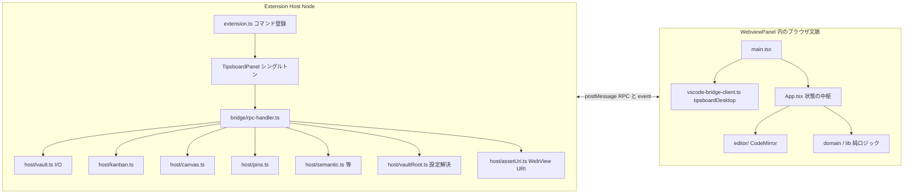
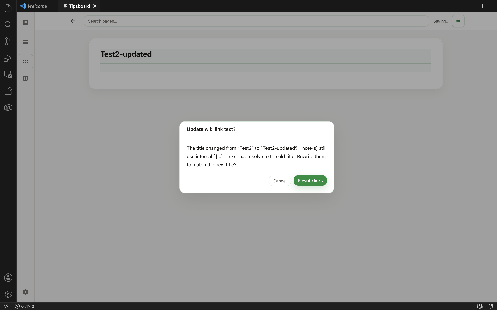
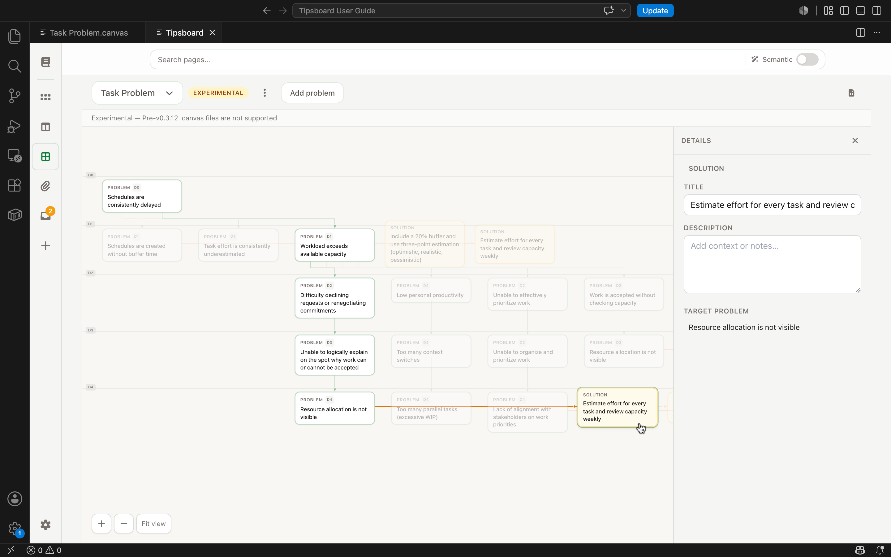

# Tipsboard for VS Code 開発仕様書（現行実装）

## この文書の読み方

- **目的**: コードを読み込まなくても、**何のための拡張か**、**どの技術境界で何をしているか**、**変更するときどこを触るか**を短時間で把握できること。
- **正（normative）の分割**:
  - **本文書**: VS Code 拡張としてのプロセス構成、設定、Bridge、Host のファイル I/O、WebView の状態設計、ビルド。
  - **Editor 共通仕様**: Markdown / Tipsboard 記法・KANBAN の意味論は **デスクトップ版 Tipsboard** の製品ドキュメント（`CURRENT_SPEC.md`、本リポジトリ外）を参考にする。ただし VS Code 版のファイル配置は、workspace root 配下の Markdown 階層をそのまま読む現行実装を正とする。
- **更新方針**: 挙動の「意図」が変わったら本書を直す。ロードマップより **今のコードの事実** を優先する。

---

## 1. なぜこの拡張があるか（製品目的）

Tipsboard は **ローカルフォルダ（vault）だけ**で動く Markdown ベースの PKM（Personal Knowledge Management）である。**アカウントやクラウド同期に依存せず**、ファイルは普通の `.md` と画像・設定 JSON としてディスクに残る。

**VS Code 版の狙い**は次の通り。

1. **開発・執筆・メモを IDE 内で完結**させる。別アプリ（Electron 版 Editor）を開かなくても、同じ vault を編集できる。
2. **既存の Markdown ワークスペースをそのまま扱う**。VS Code で開いた vault root 配下の `.md` を再帰的に読み、`docs/`、`adr/`、`meeting-notes/` などのフォルダ階層を主要な整理構造として保つ。Tipsboard 管理データは `.tipsboard/*.json`、画像・添付は `assets/` 配下に置く。
3. **WebView ではファイルシステムに触れない**という VS Code のセキュリティモデルに従い、その分 **Extension Host に I/O とパス検証を集約**する。
4. UI は Editor と同系の **React + CodeMirror** を再利用できるよう、`window.tipsboardDesktop` という **薄いデスクトップ API シム**の背後で RPC を隠す。

`package.json` の説明文どおり、機能の要約は「vault 上のノートグリッド、バックリンク付きエディタ、KANBAN、**Canvas（問題構造エディタ、experimental）**、Mermaid・数式、画像、プレーンファイル、**添付ファイル一覧（Attachments ビュー）**、**セマンティック検索（ローカル、既定で有効）**」である。

---

## 2. 全体アーキテクチャ（1 枚の見取り図）



- **Host** は `fs`・ダイアログ・`vscode.Uri`・`asWebviewUri` だけが触れる「信頼境界」。
- **WebView** は `acquireVsCodeApi().postMessage` だけが Host へ届く。DOM・CodeMirror・React はすべてここ。

---

## 3. リポジトリ内の責務配置（どこに何があるか）

| 領域 | パス（`tipsboard-vscode/` 以下） | 役割 |
| --- | --- | --- |
| 拡張エントリ | `src/extension.ts` | `activate` でコマンド登録。`tipsboard-vscode.semanticSearch.*` の変更時は **`clearSemanticProviderCache`**。その他の vault 関連設定変更で `TipsboardPanel.notifyVaultChanged`。 |
| パネル | `src/panel/TipsboardPanel.ts` | `WebviewPanel` 生成、HTML/CSP、`localResourceRoots`、`FileSystemWatcher`（vault コアファイル）、メッセージ受信 → `handleRpcInbound`、Host→WebView イベント（`vault-root-changed`、`vault-files-changed`）。 |
| RPC | `src/bridge/protocol.ts`, `rpc-handler.ts` | メッセージ形と `method` ディスパッチ。 |
| Vault I/O | `src/host/vault.ts` | スナップショット読み書き、ノート CRUD、画像インポート、JSON import/export。 |
| Canvas（Host） | `src/host/canvas.ts` | `.tipsboard/canvas/*.canvas` の一覧・読み書き・作成・削除。Mermaid テキストの parse/serialize。 |
| セマンティック検索（Host） | `src/host/semantic.ts`, `semanticProviderFactory.ts`, `semanticSettings.ts` | vault root 配下の Markdown を再帰的にチャンク化し、パス文脈も含めて embedding・`.tipsboard/semantic/` への索引書き込み・検索。設定 `tipsboard-vscode.semanticSearch.*` と `ExtensionContext.globalStorageUri` 配下のモデルキャッシュ。 |
| KANBAN（Host） | `src/host/kanban.ts` | `.tipsboard/kanban.json` の読み書きとドメイン操作。 |
| KANBAN（WebView） | `webview/src/components/KanbanBoardView.tsx` | ボード UI、HTML5 ドラッグ＆ドロップ、`moveKanbanNote` での位置指定。並びインデックス補助は `webview/src/lib/kanbanDropPosition.ts`。 |
| Canvas（WebView） | `webview/src/components/canvas/` | `CanvasView`（キャンバス切替・保存 UI）、`CanvasGraph`（グラフ描画）、`CanvasDetailPane`（ノード選択時の詳細）。詳細は [`CANVAS_SPEC.md`](./CANVAS_SPEC.md)。 |
| ピン | `src/host/pins.ts` | `.tipsboard/pins.json`。 |
| Vault 解決 | `src/host/vaultRoot.ts` | ワークスペース + 設定から絶対パスを決定、フォルダピッカー。 |
| アセット URI | `src/host/assetUri.ts` | `assets/images/` の相対パスを WebView 用 URI に限定変換。 |
| 共有型 | `src/types/editor.ts` | Host 側 TypeScript 型（`VaultSnapshot` など）。WebView 側は `webview/src/types` で同様。 |
| WebView エントリ | `webview/src/main.tsx` | `process-shim` → **`vscode-bridge-client` を先に import**（`window.tipsboardDesktop` 注入）→ i18n/CSS → `App` マウント。 |
| Bridge クライアント | `webview/src/vscode-bridge-client.ts` | RPC Promise、`prefetchAssets` / `ensureVaultImageUrl`、外部ブラウザ `openExternalInHost`。 |
| UI 中枢 | `webview/src/App.tsx` | `VaultSnapshot` を React 状態の中心に持つ。**`mergeVaultSnapshotFromHost`**（Host 一式を取り込みつつ **`diskCommittedTitle` 再構成**）、一覧 / エディタ / KANBAN / ガイド。ノート編集中は本文幅を変えず、エディタカード右上に **控えめなアイコンのみの操作**（ピン・HTML エクスポート・削除）。 |
| エディタ | `webview/src/components/NoteEditor.tsx`, `webview/src/editor/`, `webview/src/lib/editorViewState.ts` | CodeMirror 初期化、保存プラグイン、装飾、リンク、画像ドロップ。ノート path 単位でカーソル・スクロールをキャッシュし、タブ切替や `editorSessionId` による再マウント後に復元。 |
| グラフ・検索 | `webview/src/lib/noteIndex.ts`, `webview/src/lib/nearNotes.ts`, `searchNotes` 等 | メモリ上のリンクグラフ、補完候補、タグ、**ヘッダーによるキーワード検索**。選択中ノートの Related 領域では、セマンティック検索が有効なときのみ `semanticSearch`（debounce 済みドラフト本文）の結果を近傍ノートとして表示。近傍は自分自身・既存リンク関連・弱いスコアを除外し、カード内に一致度、ヒット見出し、本文スニペットを出す。発リンク・被リンクがどちらもない場合はリンク孤立として通知する。セマンティック検索本体は Host 側（`semantic.ts`）と RPC。 |
| ドメイン | `webview/src/domain/` | タイトル正規化、リンク抽出（`extractLinks`、`INTERNAL_LINK_RE`）、**改名時リンク文言書き換え**（`rewriteInboundWikiTitles.ts`）など Editor と整合した純関数群。 |
| ユーザーガイド | `webview/src/user-guide/` | 同梱 Markdown 相当の長文（日英）。 |
| Host ビルド | `tsconfig.extension.json` | `src` → `dist/extension/`（CommonJS）。`scripts/build-extension.cjs` で esbuild バンドル後、`scripts/copy-extension-deps.cjs` が **`@huggingface/transformers` ツリー（optional 含む）** を `dist/extension/node_modules/` に複製し、Marketplace 向け `vsce package --no-dependencies` でもランタイム解決できるようにする。 |
| WebView ビルド | `webview/vite.config.ts` | 単一 ES バンドル → `dist/media/webview.js` + `webview.css`。 |

---

## 4. ライフサイクルとシングルトンパネル

### 4.1 起動

- `activationEvents` は **`onCommand:tipsboard-vscode.open` のみ**。拡張本体はコマンド実行までロードされない。
- `Tipsboard: Open` で `TipsboardPanel.render(context)` が呼ばれる。

### 4.2 パネルの単一性

- `TipsboardPanel.current` に **開いているパネルが最大 1 つ**保持される。
- 既に存在する場合は **`reveal(activeEditorColumn)`** のみ。新規 `createWebviewPanel` は作らない。
- `onDidDispose` で `current` を `undefined` に戻す。

### 4.3 隠れたタブでの状態

- `retainContextWhenHidden: true` のため、タブを切り替えても **WebView 内の JavaScript 状態（React）が維持**される。

### 4.4 Vault とコアファイルの変更通知（Host → WebView）

#### 4.4.1 Vault ルート変更

次のとき `TipsboardPanel.notifyVaultChanged` が呼ばれうる。

- **設定** `vaultFolder` の変更（`onDidChangeConfiguration`）。
- **ワークスペースフォルダの追加・削除**（`onDidChangeWorkspaceFolders`）で `resolveVaultFsPath` を再評価。

処理内容:

1. `setVaultRoots(vaultFsPath)` で `localResourceRoots` を `[extensionUri, vaultUri]` に更新（併せてファイル watcher の張り替え。詳細は 4.4.2）。
2. `postMessage` で `{ source: "tipsboard-vscode-host", kind: "event", event: "vault-root-changed" }`。

WebView の `App.tsx` はこれを受けて **`getSnapshot()` を再度叩く**。また `snapshot.vaultPath` が変わったとき **`clearTipsboardResolvedAssetCache()`** で画像 URI キャッシュを捨てる（別 vault で同じ相対パスが衝突するのを防ぐ）。

#### 4.4.2 同一 Vault 内のコアファイル変更（外部エディタ・Git・同期など）

`setVaultRoots` のたびに、現在の vault 絶対パスが変わっていれば **既存の `FileSystemWatcher` を dispose** し、次の相対パターンを **`vscode.workspace.createFileSystemWatcher` + `RelativePattern(vaultRoot, …)`** で監視する。

- `**/*.md`
- `.tipsboard/kanban.json`
- `.tipsboard/pins.json`
- `.tipsboard/canvas/*.canvas`

`onDidCreate` / `onDidChange` / `onDidDelete` で通知された URI から **vault 相対パス**へ正規化し、`.tipsboard/`、`.git/`、`node_modules/`、`dist/`、`build/`、`out/` 配下の Markdown は watcher helper で除外する。**約 250ms debounce** の間に変更パスを集約する。Tipsboard Host が RPC 経由で直近に書き込んだパスは短時間 **マスク**し、WebView には載せない。JSON import の大量更新時は短時間 **一括マスク**する。

まとめて次を送る（変更がマスク後に空なら送らない）。相対パスが特定できない場合は `paths` を付けず従来互換で送る。

`{ source: "tipsboard-vscode-host", kind: "event", event: "vault-files-changed", paths?: string[] }`

WebView の `App.tsx` の挙動:

- **`paths` があり、かつ選択中ノートのパスが含まれない** → `getSnapshot()` で再同期（一覧・KANBAN 等のみ裏側で更新）。
- **`paths` が無い**（未知の変更）→ **未保存/保存エラー**（`unsaved` / `error`）なら **何もしない**（エディタ内容を保護）、そうでなければ `getSnapshot()`。
- **`paths` に選択中ノートが含まれ、未保存/保存エラーがある** → 自動では上書きせず **何もしない**（リロードバナーは出さない）。保存後や未保存なしの状態では `getSnapshot()` で反映する。
- **上記いずれかで `getSnapshot()` した結果**、選択中ノートが同一路径で残り、**ディスク上の本文が前回スナップショットと異なる**場合は `editorSessionId` を進め **`NoteEditor` を再マウント**して CodeMirror の初期 doc を差し替える。

---

## 5. Vault パス解決（設定とワークスペース）

`resolveVaultFsPath()`（`src/host/vaultRoot.ts`）の**決定順は固定**で、上から試す。

1. **ワークスペースフォルダが 1 つだけ** → その `uri.fsPath` を vault とする。
2. **マルチルート** かつ **`tipsboard-vscode.vaultFolder`** が非空  
   - 絶対パスならそのまま。  
   - そうでなければ、フォルダの **表示名**または **fsPath との一致**で最初のヒット。
3. 上記いずれでも決まらない → `undefined`（**vault 未選択**）。WebView はオンボーディングを表示する（フォルダ未オープン、またはマルチルートで `vaultFolder` 未設定）。

パネル内に vault フォルダ選択 UI は持たない。別の vault を使うときは VS Code 側でフォルダを開き直す。

---

## 6. WebView パネルの技術仕様

### 6.1 定数

| 項目 | 値 |
| --- | --- |
| `viewType` | `tipsboard-vscode.main` |
| タブタイトル | `Tipsboard` |
| 読み込むスクリプト | `dist/media/webview.js`（`asWebviewUri`） |
| スタイル | `dist/media/webview.css` |

### 6.2 生成される HTML

`TipsboardPanel.buildHtml()` が **文字列で HTML 全文**を返す。

- **CSP**: `default-src 'none'`、`script-src` に nonce、`style-src` に `cspSource` と `'unsafe-inline'`、`img-src` に `cspSource` と `http:` `https:` `data:`、`font-src` に `data:`、`worker-src` に `blob:`。
- **nonce**: 32 文字の英数字ランダム。`script` タグに `nonce="..."` を付与。
- **目的**: WebView 内スクリプトの実行を制限しつつ、バンドル JS・フォント・リモート画像（Markdown）を許容する。

### 6.3 `localResourceRoots`

- **拡張ルート**は常に含める（バンドル CSS/JS）。
- **vault ルート**は `getSnapshot` のたびに `setVaultRoots` で追加。これにより **`asWebviewUri(file(vault + relative))`** で **vault 内ファイル**を WebView から読める（主に `assets/images/`）。

---

## 7. Bridge（RPC）仕様

### 7.1 形（プロトコル）

**要求（WebView → Host）** — `src/bridge/protocol.ts` の `RpcInbound`:

- `source`: 常に `"tipsboard-vscode"`
- `kind`: 常に `"rpc"`
- `id`: ユニーク文字列（WebView は `crypto.randomUUID()`）
- `method`: 下記の識別子
- `payload`: 任意（JSON 直列化可能な構造に限定する実装）

**応答（Host → WebView）** — `RpcOutbound`:

- `source`: `"tipsboard-vscode-host"`
- `kind`: `"rpc-result"`
- `id`: 要求と同じ
- `ok`: boolean
- `result` / `error`: 成功時・失敗時

WebView（`vscode-bridge-client.ts`）は `ok === false` で **`Error` reject**。`pending` Map で id と Promise を対応付け。

### 7.2 イベント（RPC 以外）

| フィールド | 例 |
| --- | --- |
| `source` | `tipsboard-vscode-host` |
| `kind` | `event` |
| `event` | `vault-root-changed`（vault パスがコマンド／設定から変わったとき） |
| `event` | `vault-files-changed`（監視中のコアファイルがディスク上で変わったとき。debounce 後。任意で `paths: string[]` に相対パス一覧） |

RPC 応答リスナは `kind === "rpc-result"` のみ処理し、イベントは無視する。

### 7.3 `window.tipsboardDesktop`（WebView から見た API）

`webview/src/global.d.ts` に型がある。**実体は `vscode-bridge-client.ts` の `wireDesktop()`** が `main.tsx` より先にロードされて付く。

| メンバー | 振る舞い（現行） |
| --- | --- |
| `getSnapshot` | RPC `getSnapshot` |
| `createNote` / `saveNote` / `deleteNote` / `setNotePinned` | 各 RPC |
| KANBAN 一式 | 各 RPC、戻りは基本的に **更新後の `VaultSnapshot`** |
| `exportJson` / `importJson` | ダイアログ + I/O |
| `importImages` | パス配列（絶対 or vault 相対）からコピー（画像および許可された非画像） |
| `importAttachmentBuffers` | ドラッグ＆ドロップ等。`Uint8Array` を **number 配列**に展開して RPC（構造化クローンの都合）。画像・非画像を順に処理 |
| `prefetchAssets` | `resolveAssetUris` の結果を **メモリ Map にキャッシュ** |
| `resolveAssetUrl` | **同期だがキャッシュヒット時のみ**文字列。初期は空 |
| `getPathForFile` | **常に `""`**（Electron 専用 API のスタブ） |
| `semanticSearch` | RPC `semanticSearch`（`{ query, limit? }`） |
| `updateSemanticIndex` / `rebuildSemanticIndex` | RPC（差分更新 / 完全再構築） |
| `onOpenFind` / `onFindNext` / `onFindPrevious` | **空の unsubscribe を返すだけ**（VS Code メニュー未接続） |

**開発上の意味**: Editor 由来の `NoteEditor` / CodeMirror は `onOpenFind` 等にフックするが、VS Code 版では **CodeMirror の検索パネル（`@codemirror/search`）がローカルに完結**する。

### 7.4 RPC メソッドと Host 実装の対応表

vault 未選択時、**`getSnapshot` を除き**概ね `Error: Vault folder is not selected`。

| method | payload 型（要旨） | result（要旨） | 備考 |
| --- | --- | --- | --- |
| `getSnapshot` | なし | `VaultSnapshot` | 併せて `panel.setVaultRoots(vaultPath)`。`VaultSnapshot` に **`vaultResolution`** と **`attachmentMaxBytes`** を載せる |
| `createNote` | string | `{ notePath, note: NoteSummary }` | WebView は `mergeCreatedNoteIntoSnapshot` で `snapshot.notes` を更新（ホストはフル `readVault` を返さない） |
| `saveNote` | `{ path, body }` | `{ notePath, note: NoteSummary }` | WebView は `upsertSavedNote` でマージ。タイトル stem 変化でリネーム可 |
| `deleteNote` | string | `VaultSnapshot` | |
| `setNotePinned` | `{ path, pinned }` | `VaultSnapshot` | |
| `createKanbanBoard` | string | `VaultSnapshot` | |
| `updateKanbanBoard` | `{ boardId, name? }` | `VaultSnapshot` | |
| `deleteKanbanBoard` | string | `VaultSnapshot` | |
| `createKanbanColumn` | `{ boardId, name }` | `VaultSnapshot` | |
| `updateKanbanColumn` | `{ columnId, name?, position? }` | `VaultSnapshot` | |
| `deleteKanbanColumn` | string | `VaultSnapshot` | |
| `reorderKanbanColumns` | `{ boardId, columnIds }`（列 ID の並び順） | `VaultSnapshot` | |
| `moveKanbanNote` | `{ boardId, notePath, toColumnId, position? }` | `VaultSnapshot` | |
| `exportJson` | なし | boolean | Save ダイアログ、キャンセルで `false` |
| `importJson` | なし | `VaultSnapshot` | Open ダイアログ |
| `importImages` | string[] | `ImportedImage[]` | サイズ上限は設定 `tipsboard-vscode.maxAttachmentBytes` |
| `importAttachmentBuffers` | `{ entries: { name, data: number[] }[] }`（旧: 配列のみ） | `{ imported: ImportedImage[]; attachments: VaultAttachmentSummary[] }` | 添付一覧の即時更新用に **`attachments`** を同梱 |
| `getAttachmentSummaries` | なし | `VaultAttachmentSummary[]` | `assets/files/` の列挙とノート本文からの参照抽出のみ（軽量）。保存後の一覧更新など |
| `openVaultAsset` | string（vault 相対 **`assets/files/`** のみ） | undefined | 存在確認後、**Windows は `cmd start`**、それ以外は **`vscode.env.openExternal`** で OS 既定アプリ |
| `resolveAssetUri` | string | string | 不正パスは `""` |
| `resolveAssetUris` | `{ paths }` | `Record<string,string>` | |
| `openExternal` | `{ uri }` | undefined | **http/https のみ** `openExternal` |
| `semanticSearch` | `{ query?, limit? }` | `SemanticSearchResponse`（`results`, `indexedChunkCount`, `modelId`） | 設定 `semanticSearch.provider === off` のときはエラー。それ以外は `host/semantic.ts` が索引を確保して検索 |
| `rebuildSemanticIndex` | なし | `SemanticIndexManifest` | 同上。全 vault ノートから索引を再構築 |
| `getCanvas` | `{ relativePath }` | `CanvasDocument` | `.tipsboard/canvas/` 配下の `.canvas` のみ |
| `saveCanvas` | `{ relativePath, document }` | `CanvasSummary[]` | debounce 保存後に一覧を返す |
| `createCanvas` | `{ name? }` | `CanvasSummary[]` | 空ドキュメントで新規 `.canvas` を作成 |
| `deleteCanvas` | `{ relativePath }` | `CanvasSummary[]` | ファイル削除後に一覧を返す |

---

## 8. Host 側ファイル仕様（ディスク上の真実）

### 8.1 ディレクトリツリー（慣例）

```
vault/
  docs/auth/oauth.md   … ノート（vault 相対の任意階層）
  adr/0001-*.md        … ノート
  inbox/*.md           … Tipsboard で作った新規ノートの初期保存先（inbox）
  assets/images/       … インポート画像（WebView 表示許可パス）
  assets/files/        … インポート添付ファイル（本文は `[label](assets/files/...)`、開く際は Host RPC）
  .tipsboard/
    kanban.json
    pins.json
    canvas/              … 問題構造 Canvas（*.canvas Mermaid）
    semantic/            … セマンティック検索索引（生成物）
      manifest.json
      chunks.json
      vectors.f32
```

#### 8.1.1 セマンティック検索索引（`.tipsboard/semantic/`）

- **詳細仕様・評価方式**: [`SEMANTIC_SEARCH.md`](./SEMANTIC_SEARCH.md)（チャンク化、スコアリング、hybrid、開発用ベンチマーク）。
- **用途**: セマンティック検索利用時に、vault root 配下の Markdown から作ったチャンクとベクトルを保持する（Git に含めない運用が推奨）。
- **ファイル**: `manifest.json`（スキーマ・モデル id・次元・件数・日時）、`chunks.json`（メタデータと本文断片）、`vectors.f32`（Float32 連結）。
- **モデル本体**: Transformers.js のキャッシュ（既定は Hub から初回取得、`allowRemoteModels` 既定 `true`）。閉域では `false` + `modelCachePath` と `prepare:semantic-model-cache` 配布。詳細は [`SEMANTIC_SEARCH.md`](./SEMANTIC_SEARCH.md) の「オンライン利用と閉域利用」。

#### 8.1.2 Canvas（`.tipsboard/canvas/`）

- **用途**: 問題構造エディタ。問題の深掘り、原因構造の可視化、解決策の整理、打ち手の意思決定。製品仕様の詳細は [`CANVAS_SPEC.md`](./CANVAS_SPEC.md)。
- **ファイル**: `<name>.canvas`（Mermaid テキスト、`%% tipsboard-canvas-version: 1` ヘッダ必須）。ノードは `problem` / `solution`、エッジは `because` / `solved_by`。
- **Host**: `src/host/canvas.ts` が parse/serialize（`src/shared/canvasMermaid.ts`）・CRUD を担当。WebView は RPC 経由で debounce 保存する。

### 8.2 ノートパスの検証

`assertSafeRelativePath`（`vault.ts`）: 正規化後に **vault 相対の Markdown パス**であることを要求する。`..`、絶対パス、`.md` 以外、`.tipsboard/`、`.git/`、`node_modules/`、`dist/`、`build/`、`out/` 配下は拒否する。サブフォルダは許可する。

### 8.3 タイトル・ファイル名

- **タイトル**は本文 **先頭行**（`extractTitle`）。
- **新規作成時**、`createNote` は vault root 直下の `inbox/` に `stem.md` を作る。`inbox` がファイル等で使えない場合は `Tipsboard inbox/`、`Tipsboard inbox 2/` ... にフォールバックする。
- **保存時**、先頭行から stem を作り、**既存ファイル名と異なれば同じディレクトリ内でリネーム**（衝突時は `stem (2).md` のようにユニーク化）。既存フォルダ階層は保存だけでは変えない。
- リネーム時、**KANBAN** の `note_path`、**pins** のパスを **パッチ**する。
- 本文側の単一ブラケット **内部ウィキリンク**の文言については、§9.6 のとおり WebView が **オプション**かつ確認付きで一括書き換えする（ホスト側 `saveNote` の責務外）。

### 8.3.1 Inbox 整理提案

- `inbox/` または `Tipsboard inbox/` 系フォルダ内のノートは、WebView 上で未整理として表示する。
- `getOrganizeSuggestions` は実行時点の vault を読み直し、既存フォルダのみを移動先候補にする。候補には inbox 系フォルダ、除外ディレクトリを含めない。
- 提案 signal は、内部リンク、セマンティック近傍、タグ分布、タイトルパターン、フォルダ語彙 profile とする。セマンティック検索が off の場合は、リンク、タグ、キーワード系 signal のみで候補を返す。
- `moveNoteToFolder` はユーザー確認後にだけ呼び出される。移動先に同名ファイルがある場合は `stem (2).md` のように一意化し、移動後に KANBAN と pins のパスをパッチする。
- 対象ノート内に通常の Markdown 相対リンクがある場合、WebView は移動前に確認を促す。初期仕様では相対リンク本文の自動修正は行わない。

### 8.4 `readVault` の正規化

- vault root 配下を再帰列挙し、各 Markdown ファイルを `NoteSummary` に。`.tipsboard/`、`.git/`、`node_modules/`、`dist/`、`build/`、`out/` 配下と、読めないエントリはスキップする。
- ソート: **`updatedAt` 降順**、同値なら **タイトル昇順**。
- **KANBAN**: 存在しないノートを指すカードを削除し、JSON が変われば保存。
- **pins**: 存在しないパスを剪定し、JSON が変われば保存。
- **表示順**: `pins` に登録されたパスを **`reorderNotesWithPins`** で先頭に並べ、残りはソート順。

### 8.5 添付ファイルインポート

- **サイズ上限**: 各ファイル **`tipsboard-vscode.maxAttachmentBytes`**（既定 10MiB）。`importAttachmentBuffers` と `importImages` で共通。超過時は **`TIPSBOARD_ATTACHMENT_TOO_LARGE`**（RPC エラー）。
- **ブロック拡張子**: `.exe`, `.msi`, `.dmg`, `.pkg`, `.app`, `.bat`, `.cmd`, `.ps1`, `.sh`, `.zsh`, `.bash`, `.com`, `.scr`, `.jar` など（`vault.ts` の **`BLOCKED_ATTACHMENT_EXTS`**）。該当エントリは **スキップ**（エラーにしない）。

#### 画像

- MIME / 拡張子: **`.png`, `.jpg`, `.jpeg`, `.gif`, `.webp`**。
- 保存名: **`assets/images/img_<uuid><ext>`**。
- 挿入 Markdown: **``**（`alt` は元ファイル名由来をサニタイズ）。

#### 画像以外（データファイル等）

- 保存名: **`assets/files/{元ファイル名サニタイズ}_{8桁16進}{ext}`**（拡張子なしの場合は末尾のみ `_` + ID）。同一内容の再取り込みは既存ファイルを再利用（従来の `file_<uuid>` 名のファイルもそのまま読み取り可能）。
- 挿入 Markdown: **`[label](relativePath)`**（標準リンク。`tipsboard-links.ts` がクリックを **`openVaultAsset`** に転送）。

- **`importImages`**: ソースは **絶対パス**または **vault からの相対**（`..` 混入はスキップ）。実ファイルのみコピー。画像は上記 images、非画像は files。
- **`importAttachmentBuffers`**: WebView の Shift+ドロップ等。バッファを順に処理し、画像／非画像で保存先を振り分ける。

- 戻り値型 **`ImportedImage`**: `relativePath` と `markdown`（画像・添付共通で再利用）。

### 8.6 アセット URI

`assetPathAllowed`: 正規化後 **`assets/images/` または `assets/files/`** プレフィックスのみ（`..` や `/../` を含むパスは拒否）。`toAssetWebviewUri` は検証失敗時 `null` → RPC は空文字またはキー省略。現状プレビュー用途は主に **`assets/images/`**。

### 8.7 JSON export / import

- **export**: `schemaVersion: 1`、`project` 名、`exportedAt`、`pages` 配列（各ノートの title, normalized_title, body, 日時）。`deleted_at: null` フィールドを含む形（`ExportPage` 型）。
- **import**: `schemaVersion` が 1 で `pages` が配列でなければ例外。`deleted_at` が付いたページはスキップ。既存ノートは **`normalized_title` 一致で上書き**、なければ `inbox/`（またはフォールバック先）に `allocateUniqueFilename` で新規作成。`pages` というフィールド名は export 形式の互換名であり、ディスク上の `pages/` ディレクトリを意味しない。

### 8.8 同時編集・ファイル監視

`TipsboardPanel` は vault root に対して `**/*.md` と `.tipsboard/kanban.json` / `.tipsboard/pins.json` / `.tipsboard/canvas/*.canvas` の `FileSystemWatcher` を張る。外部エディタ・Git・同期ツールなどで変更された場合は §4.4.2 の `vault-files-changed` で WebView に通知し、未保存状態を尊重しながら `getSnapshot()` で再同期する。

---

## 9. WebView 側アプリケーション仕様（`App.tsx` を中心に）

### 9.1 状態の中心: `VaultSnapshot`

- `snapshot: VaultSnapshot` が **アプリのキャッシュされた vault 全体**（全ノートの `body` を含む）。
- **`attachmentMaxBytes`**: `getSnapshot` の応答に含まれる（設定 **`tipsboard-vscode.maxAttachmentBytes`**）。部分的な RPC が `VaultSnapshot` を返す場合、`mergeVaultSnapshotFromHost` は **欠けているとき既存値を温存**する。
- マウント時に **`getSnapshot()`** を必ず呼ぶ。`vaultPath === null` なら **オンボーディング画面**のみ表示（VS Code でフォルダを開く、またはマルチルートで `vaultFolder` を設定する案内）。

### 9.2 主要な React state（概念）

| state | 意味 |
| --- | --- |
| `snapshot` | 上記。KANBAN・Canvas 一覧・pins・全ノート本文。 |
| `selectedPath` | 現在選んでいるノートの vault 相対 Markdown パス（例: `docs/auth/oauth.md`, `inbox/New Idea.md`）または null。 |
| `openTabs` / `activeTabId` | WebView 内タブ（ノート path またはタグ検索）。`webview/src/lib/editorTabs.ts` のヘルパで追加・フォーカス・重複排除。 |
| `viewMode` | `"list"` \| `"kanban"` \| `"canvas"` \| `"attachments"` \| `"organize"`。左サイドバーから切替（Canvas は格子アイコン、`Ctrl+Shift+C` / `⌘⇧C`）。 |
| `kanbanFocus` | ボード / 列 / カードのフォーカス情報 |
| `editorSessionId` | ノート切り替え時にインクリメントし **`NoteEditor` をリマウント**させるトリガ。カーソル・エディタ内スクロール・ノートビュー外側スクロールは path 単位のメモリキャッシュ（`webview/src/lib/editorViewState.ts`）に離脱時保存し、再マウント後に復元する。 |
| `saveState` | `"idle" \| "unsaved" \| "saving" \| "saved" \| "error"`（CodeMirror 保存プラグインから供給） |
| `query` / `listSearchFilter` | ヘッダー検索入力とカード一覧フィルタ。Enter で `query.trim()` を `listSearchFilter` に反映して一覧へ戻り、候補ドロップダウンのクリックは直接ノートを開く。 |
| セマンティック検索モーダル | ヘッダーの wand から開く。`semanticSearchOpen` / `semanticQuery` / `semanticResults` 等。`tipsboardDesktop.semanticSearch` を呼ぶ（設定 off 時は Host がエラー）。 |
| `nearNotes` / `nearNotesBusy` | 選択中ノートの本文を `semanticSearch` に渡して得た候補を `webview/src/lib/nearNotes.ts` でノート単位に集約した Related 表示用 state。`getSemanticSearchSettings.enabled` が false（`semanticSearch.provider === off`）のときは RPC も UI も出さない。編集時は debounce 済み本文で 800ms 後に再検索し、入力中は直前結果を維持。ノート切替時は debounce をスキップして即検索。検索が失敗した WebView セッションでは再試行しない。 |
| `userGuideOpen` | 同梱ガイドの表示 |
| メニュー open フラグ | vault / local のドロップダウン |

### 9.3 衍生データ（`useMemo`）

- **`buildNoteIndex(snapshot.notes)`**: 各ノートの **外向きリンク・バックリンク・2-hop・newLinks・タグ**、および補完用 `suggestions`。
- **`selectedEntry` / `selectedNoteIsLinkIsolated`**: 選択中ノートのリンク関連と、`outgoing.length === 0 && backlinks.length === 0` によるリンク孤立判定。
- **近傍ノート集約**: `semanticSearch`（debounce 済みドラフト本文、limit 20）の結果から、自分自身・既存リンク関連・スコア `0.45` 未満を除外し、同じ `path` は最大スコアのチャンクにまとめて最大 6 件を Related 領域へ渡す。
- **`searchResults`**: ヘッダー検索候補用。Enter は先頭候補を開かず、`listSearchFilter` に検索語を入れてカード一覧を絞り込む。
- **`listDisplayNotes`**: 一覧はオプションで `listSearchFilter` により部分集合化し、**`sortNotesWithPinOrder`** でピン優先表示。
- **`selectedKanbanStatuses`**: 選択ノートがどのボードのどの列にあるか（エディタまわりの表示用）。

### 9.4 ナビゲーション履歴（NavMemory）

- **バック**用 **`navHistoryRef`** と **進む**用 **`navForwardRef`**。**各リスト最大 50**。超過時は末尾を push し、先頭を `shift()`。共有ロジックは **`webview/src/lib/navMemory.ts`**（`cloneNavMemory` / `pushNavStackLimited` / `navMemoryEqual`）。
- `pushNavHistory` は遷移前の状態として **選択ノート・viewMode・KANBAN フォーカス・ガイド開閉・一覧フィルタ・`openTabs` / `activeTabId`・検索バー `query` / `showSearchResults`** をバック側に保存し、このとき **進む側を空にクリアする**（新しい遷移で「進む」を無効化するため）。
- **戻る**はバック側を popし、復元実行前に **現在状態を進む側に push**。**進む**は進む側を popし、復元実行前に **現在状態をバック側に push**。いずれも未保存時は **`confirmDiscardChanges`** で確認ダイアログを挟んだのち状態を復元。
- **`pushNavHistory` を呼ぶ**操作（別ノートへ、カード一覧・KANBAN・ガイド等）で適宜バック側へ積む。フォルダ変更・JSON import などで **両スタックを空にする**。

### 9.5 未保存扱い

- `saveState` が `unsaved` / `error` のとき **`hasUnsavedChanges`**。
- ノート切替・フォルダ選択・新規作成・履歴戻りの前に **`confirmDiscardChanges`**（確認ダイアログ）。
- `beforeunload` でブラウザ標準の離脱警告を登録（WebView では効かない環境もあるが、**アプリ内の保存表示が主**）。

### 9.6 保存パイプライン（エディタ～Host）

1. `NoteEditor` は `createEditor` に `save: { onSave, onStateChange }` を渡す。
2. **`createManualSavePlugin`（`tipsboard-save.ts`）**: ドキュメント変更後デバウンスし **`onSave(content)`** を非同期実行。連打時はキューイング。
3. `onSave` → `App.handleSaveNote` → **`tipsboardDesktop.saveNote(path, body)`**。
4. 成功後、`result.notePath` が変わっていれば（リネーム）**`selectedPath` と `noteRef` を更新**。
5. `App` は **`upsertSavedNote`** で `snapshot.notes` の該当要素を **`NoteSummary` 全置換**（本文・タイトル・preview・日時）。
6. **内部リンク文言の書き換え（任意・確認あり）**: ディスク準拠の直前タイトルを `diskCommittedTitle` ref（パスキーは **`/` に正規化**）で追跡し、保存後 **`normalizeTitle` が変わった**ときは、WebView の `snapshot` がディスクより遅れる（未保存編集中に外部変更を無視している等）ことがあるため、**リンク一覧のために `getSnapshot()` を追加で読み直し**、コードフェンス外の内部 `[ … ]` で旧正規化名に一致する表示を列挙する。検出があると **確認ダイアログ** を出し、承認時は対象ごとに `saveNote` を順次実行する（当該ノート自身は同名パスでの再保存、終了後 **`editorSessionId` を進めてエディタを再マウント**）。却下または対象なしでは本文は変えない。直前スナップショット以降の競合編集までは検知しない。



*図: タイトルの正規化が変わる保存のあと、`[ … ]` 形式のリンクに一致する文言が複数ノートにある場合に表示される確認（文言は UI 言語設定に準拠）。*

7. **`mergeVaultSnapshotFromHost`** が `getSnapshot`/import/delete など **Host が返す一式の `VaultSnapshot`** をセットするときのみ `diskCommittedTitle` を全ノートから再構成する。**`handleDraftNoteChange` では再構成しない**。

入力中は **`handleDraftNoteChange`** で `snapshot` 内の当該ノートだけタイトル／preview を軽く更新し、一覧カードの見た目を即時反映する。

### 9.7 キーボードショートカット

**VS Code 拡張がバインドする操作（WebView パネルがアクティブなとき）**

| 操作 | キー | 備考 |
| --- | --- | --- |
| 新規ノート | `mod+N` | `package.json` の `keybindings`（`when: activeWebviewPanelId == 'tipsboard-vscode.main'`）。Host から `create-note` イベントで WebView の `handleCreateNote` を起動。WebView 左サイドバーの **+** ボタンも `handleCreateNote` を直接呼ぶ。 |
| アクティブタブを閉じる | `ctrl+alt+shift+w` / mac: `cmd+alt+shift+w` | コマンド `tipsboard-vscode.closeEditorTab`。Host から `close-editor-tab` イベント。タブが 1 枚だけのときは no-op。ネイティブ入力フォーカス中は WebView 側で無視。 |

**WebView 内 `document` のキーダウンとポインタイベント（`App.tsx`）**

`INPUT` / `TEXTAREA` / `SELECT` にフォーカスがあるとき、または **確認ダイアログ表示中**は、§9.4 の **戻る / 進む**（キー・親指ボタン・一部環境の `BrowserBack` / `XF86Back` / `BrowserForward` / `XF86Forward`）は **処理しない**。`create-note` イベント受信時も同じくネイティブ入力フォーカス中は無視する。カード一覧・KANBAN（`mod+Shift+L` / `mod+Shift+K`）も従来どおりネイティブ入力のみ抑止。**`mod+]`** は VS Code 側のインデント等と競合する可能性があるが、Tipsboard の WebView フォーカス中は **`keydown` で `preventDefault`** により NavMemory 「進む」に割り当てる。競合時はユーザーがキーマップを上書きしてよい。

| 操作 | キー（Windows/Linux では Ctrl、macOS では Cmd を mod とする） |
| --- | --- |
| カード一覧を開く | `mod+Shift+L` |
| KANBAN を開く | `mod+Shift+K` |
| Canvas を開く | `mod+Shift+C` |
| 戻る（NavMemory） | `Alt+ArrowLeft` または `mod+[` （ほか環境により `BrowserBack` / `XF86Back`） |
| 進む（NavMemory） | `Alt+ArrowRight` または `mod+]` （ほか環境により `BrowserForward` / `XF86Forward`） |
| 戻る / 進む（マウス） | **`pointerdown` の `pointerType === "mouse"` かつ `button === 3` / `button === 4`**（キャプチャ段）でそれぞれ NavMemory と同じ処理。**macOS でのトラックパッド既定スワイプ**は環境により WebView に届かない場合がある |

内部リンク・タグ・関連リンク UI では **`metaKey` / `ctrlKey` 付きクリック**で新規タブ（`tipsboard-links.ts` の `createLinkClickHandler`、`App.handleLinkClick` / `handleSelectNote`）。外部リンクは従来どおり。タブ UI は **`NoteTabBar.tsx`**。KANBAN・Canvas・ユーザーガイド表示中はタブバー非表示（`viewMode` / `userGuideOpen` による）。

### 9.8 添付（画像・ファイル）

- **ドロップ**: **Shift+ファイルドロップ**。`createLocalAttachmentDropExtension`（`tipsboard-image-drop.ts`）→ **`importAttachmentBuffers`** で Host に送り、返った Markdown を挿入。画像は PNG / JPEG / GIF / WebP。非画像は **`assets/files/`** へ保存され **`[label](assets/files/...)`** を挿入（実行系などブロック拡張子は Host / WebView でスキップ）。
- **サイズ上限**: VS Code 設定 **`tipsboard-vscode.maxAttachmentBytes`**（`VaultSnapshot.attachmentMaxBytes` と整合）。Host 側でも検証し、超過時は **`TIPSBOARD_ATTACHMENT_TOO_LARGE`**。
- **画像表示**: 本文中の `assets/images/...` は **`ensureVaultImageUrl` / `prefetchAssets`** で WebView URI に変換してから `` に載せる。画像 alt 末尾の `|1l`〜`|10r` は表示用 alt と分離して、コンテナ幅比率（`1`=10%、`10`=100%）と配置（`l` / `c` / `r`）として解釈する。例: `` は幅 50%・中央寄せ。普通の Markdown エディタでは標準画像として表示できることを優先し、サイズ指定が反映されなくてもよい。
- **`assets/files/` リンク**: `tipsboard-links.ts` が **`openVaultAsset`** RPC を発行し、Host が OS 既定アプリに委譲（**Windows + 非 ASCII パス**は `openPathWithOsDefaultApp` の `cmd start` 経由）。
- **見出しナビ（`NoteOutlineNav`）**: ノート編集時、エディタ左に ATX 見出し一覧（折りたたみ可）。`extractAtxHeadings` で本文から抽出（コードブロック・`#tag` 除外）。クリックで `NoteEditor.scrollToLine`。開閉は `localStorage`（`tipsboard.noteOutlineOpen`）。
- **装飾（`tipsboard-decorations.ts`）**: 非カーソル行では `[label](assets/files/...)` を **`cm-tipsboard-vault-attachment-link`** でラベル表示（クリップアイコンは CSS `::before`、テーブル内は DOM アイコン）。**カーソル行**は他記法と同様に生 Markdown。リンク範囲内にキャレット／選択があるときは **`isSyntaxActive`** により括弧・URL も表示（外部リンクと同じ切替）。
- **添付ライブラリ（`AttachmentLibraryView`）**: `viewMode === "attachments"` のとき一覧表示。`snapshot.attachments`（`VaultAttachmentSummary[]`）を **`searchAttachments`** で絞り込み。行から **`openVaultAttachmentInHost`**（`assets/files/` の相対パス）・参照ノートへの遷移（内部リンクと同系のスタイル）・絶対パスコピー（`joinVaultAbsolutePath`）・行展開でパス／サイズ／更新日時を表示。未参照ファイルは行末に警告表示。初回・保存後は **`getAttachmentSummaries`**、`importAttachmentBuffers` 成功時は戻り値の **`attachments`** で一覧を更新。

### 9.9 エクスポート（HTML）

- 単一ノートを **スタンドアロン HTML** に組み立てる（`export/buildPageHtml.ts`）。数式・Mermaid 等の方針は実装に準拠。
- エラーは UI に短時間表示するタイマー管理あり。

### 9.10 国際化（i18n）

- `webview/src/shared/i18n/`。言語切替は `App` のセレクトから `changeLanguage`。
- 保存キーとフォールバックは **`supportedLocales.ts`**。初回解決の純関数は **`languageResolution.ts`**（`config.ts` は `window` / `navigator` を渡して利用）。
- **初回の既定表示言語**は **英語**（`fallbackLng` / `FALLBACK_LANGUAGE`）。`localStorage` の `tipsboard.language` と、対応している場合はブラウザ優先言語がその前に使われる。
- ユーザーガイド本文は **`bundledGuide.ts` に ja / en の定数配列**として内蔵。

### 9.11 KANBAN UI（`KanbanBoardView` と D&D）

- KANBAN 一覧は **`webview/src/components/KanbanBoardView.tsx`**。カードは `draggable`、列コンテナおよび各カードに `onDragOver` / `onDrop` を持つ。
- ドロップ後、`tipsboardDesktop.moveKanbanNote(boardId, notePath, toColumnId, position)` を呼ぶ。**`position` は目的列での挿入インデックス（0 始まり）** とし、Host 側 **`src/host/kanban.ts` の `moveKanbanNote`** が同列から対象ノートを除いた peers とマージして **連番 `position`** を振り直す。
- **カード上へのドロップ**: ポインターが対象カード矩形の上半分ならそのカードの**前**、下半分なら**後ろ**へ挿入する `position` を `kanbanDropPosition.ts` で算出する。
- **列の空白（リスト下の余白など）へのドロップ**: その列の**末尾**（従来どおり）。
- **タグフィルタ**: 画面上は `visibleCardsByColumn` だが、`position` は **フィルタ前の列フルセット `cardsByColumn`** を基準に計算し、**.tipsboard/kanban.json 上の列内順がフィルタ表示と食い違って壊れない**ようにする。
- 同一カード自身へのドロップは **`position` を現位置相当にそろえる**などの補助があり、不必要な末尾移動にならない。

### 9.12 Canvas UI（`CanvasView`、**experimental**、**v0.4.0**）

仕様の背景・用語は [`CANVAS_SPEC.md`](./CANVAS_SPEC.md) を参照。

- **保存形式**: vault 相対 `.tipsboard/canvas/<name>.canvas` の Mermaid テキスト（`%% tipsboard-canvas-version: 1` ヘッダ必須）。`parseCanvasMermaid` / `serializeCanvasMermaid`（`src/shared/canvasMermaid.ts`）で内部 `CanvasDocument` と相互変換。
- **ノード種別**: `problem`（課題）、`solution`（対策）。Cause はノード種別ではなく `because` エッジで表現。
- **UI**: 中央がグラフ（パン/ズーム、深さレーン、フォーカス強調、インラインタイトル編集、エッジ付け替え・削除）。ノード選択時のみ右に **詳細ペイン**（説明・`status`・親子一覧）。Mermaid ソースはヘッダーのファイルアイコンまたは `openCanvasInEditor` RPC で VS Code を開く。



*図: Canvas 画面（グラフ + ノード選択時の詳細ペイン）。*
- **カバー判定**: 末端 Problem に Solution が 1 つでもあればカバー済み（意思決定 UI なし・記載した打ち手は採用前提）。
- **永続化**: WebView 側 debounce 保存（`saveCanvas` RPC）。
- **キャンバス管理**: ツールバーから作成・切替・削除。構造ルール警告バッジ。`getSnapshot` の `canvases: CanvasSummary[]` で一覧を保持。
- **互換性**: **v0.3.12 以前**の `.canvas`（v0.3.9–v0.3.11 の JSON ボードおよびその他の旧形式）は **v0.4.0 以降では読み込めない**。JSON は一覧から除外。パース時は `LEGACY_CANVAS_UNSUPPORTED_MESSAGE` を返す。

---

## 10. CodeMirror モジュール（開発時の地図）

`webview/src/editor/index.ts` の `createEditor` が束ねる主な拡張:

- **履歴** `history` / `historyKeymap`
- **検索** `@codemirror/search`（トップにパネル、`tipsboardKeymap` と共存）
- **装飾・言語** `tipsboardLanguage`, `tipsboardDecorations`, `tipsboardTheme`, `notebookTheme`
- **リンククリック** `createLinkClickHandler` → `tipsboard-links.ts`
- **保存** `createManualSavePlugin`
- **Shift+ドロップ添付** `createLocalAttachmentDropExtension` → `tipsboard-image-drop.ts`
- **Tipsboard 固有装飾・KaTeX・Mermaid 等**は `tipsboard-decorations.ts` ほかに分割

大きな装飾・パーサ負荷があるため、**パフォーマンス調整は主にこの層**で行う。

---

## 11. セキュリティ（実装が守っていること）

1. **パス traversal 禁止**（ノート・アセット URI とも）。
2. **Bridge**: 想定外 `method` は例外 → RPC エラー応答。
3. **外部 URL**: `openExternal` は **http/https のみ**（フィッシング対策の最低限）。
4. **`openVaultAsset`**: **`assets/files/`** のみ許可（`vaultFileAttachmentOpenAllowed`）。`toAssetDiskUri` + `stat` 後、`openPathWithOsDefaultApp`（win32: `cmd start`、他: `openExternal`）。失敗時は `showErrorMessage`。
5. **CSP**: インラインスクリプトは nonce 付きのバンドルのみ。
6. **WebView は Node を持たない**（`process-shim` はビルド互換用のスタブに留める）。

---

## 12. ビルド・パッケージ

| 手順 | コマンド / 成果物 |
| --- | --- |
| Host コンパイル | `npm run compile` → `dist/extension/*.js` |
| WebView バンドル | `npm run build:webview` → `dist/media/webview.js`, `webview.css` |
| 公開前 | `vscode:prepublish` = `compile` + `build:extension`（esbuild のあと **`copy-extension-deps`** で ML ランタイムを `dist/extension/node_modules` に同梱）+ `build:webview` |
| VSIX | `npm run package`（`vsce package --no-dependencies`）。**`dist/extension/node_modules`** は `.vscodeignore` で **`node_modules/**` の除外に例外**を付け、VSIX に含める。 |

## 13. テスト（現状の置き場）

- **Host**: `src/host/*.test.ts`（例: `vault.host.test.ts`, `pins.host.test.ts`, `kanban.host.test.ts`）。Vitest、`vitest.config.mts`。
- **WebView / domain**: `webview/src/**/*.test.ts`（装飾・数式・ソート等）。
- **WebView エディタ（ブラウザ単体）**: Playwright で `cursor-test.html` 経由の CodeMirror カーソル検証（`npm run test:webview:e2e`）。VS Code 拡張ホストの統合 E2E ではない。
- Bridge の**電送そのもの**の自動 E2E は薄く、**プロトコルは本書と `protocol.ts` が契約**となる。

---

## 14. 変更履歴

| 日付 | 内容 |
| --- | --- |
| 2026-05-15 | 初版。 |
| 2026-05-16 | RPC・設定等の実装追記。 |
| 2026-05-16 | **本全面改訂**: 製品目的、アーキテクチャ、ディレクトリ索引、App 状態・保存・ショートカット、CodeMirror 地図、未監視の事実、初期リリース/ロードマップ中心の記述をやめ現行仕様へ一本化。 |
| 2026-05-16 | KANBAN 列内カード並び替え（D&D と `moveKanbanNote` の `position`）、関連テスト、9.11 およびディレクトリ表の追記。 |
| 2026-05-16 | タイトル正規化が変わる保存後、内部ウィキリンク文言の一括書き換え（確認ダイアログ・`diskCommittedTitle`・9.6 追記）。 |
| 2026-05-16 | リンク検出時にディスク準拠の `getSnapshot()` を用い、`snapshot` 遅延でダイアログが出ないケースを防ぐ。ノートパスは `diskCommittedTitle` で `/` に正規化。 |
| 2026-05-18 | 拡張 **v0.1.7** に合わせ、`package.json` keybinding・`create-note` イベント、エディタ右の操作、既定 i18n（英語フォールバック・`languageResolution`）、関連リンク遷移時のスクロール、§9.7 / §9.10 の整理。 |
| 2026-05-16 | 拡張 **v0.1.8**: 表示モード数式ブロック付近の縦矢印で論理行が飛ばないようキーマップ調整（`tipsboard-keymap.ts`）。WebView エディタのカーソルを Vitest / Playwright で検証（§13、`DEVELOPMENT.md`）。 |
| 2026-05-16 | 拡張 **v0.1.9**: fenced code 内の `$$` を表示数式として結合しない検出修正と、数式・fenced block 近傍での `ArrowUp` / `ArrowDown` 論理行移動を追加補強。提示された fenced math examples + prose の回帰テストを Playwright に追加。 |
| 2026-05-17 | 拡張 **v0.2.0**: 置換装飾がある文書で隣接する短い行同士の縦矢印を論理1行ずつに固定し、リスト末尾から数式領域へのカーソル飛びを防ぐ。Math Expressions 体裁の Playwright 回帰を追加。 |
| 2026-05-17 | WebView **ノート／タグタブ**: `openTabs` / `activeTabId`、`NoteTabBar`、`editorTabs.ts`。Cmd/Ctrl+クリックで新規タブ、重複タブなし、最後の1タブは閉じ不可。コマンド `tipsboard-vscode.closeEditorTab`（既定 `ctrl+alt+shift+w` / mac `cmd+alt+shift+w`）、`NavMemory` にタブと検索バー状態を含む。§9.2・9.4・9.7 追記。 |
| 2026-05-19 | **NavMemory 進む**（`navForwardRef`）、戻り・進むのキー・アプリコマンド風キー・マウス 3 / 4 ボタン。確認ダイアログまたはネイティブ入力フォーカス中は無効。`webview/src/lib/navMemory.ts`。§9.4・9.7 追記。拡張リリース **v0.2.4**。 |
| 2026-05-17 | 拡張 **v0.2.5**: 非画像添付（`assets/files/`、`importAttachmentBuffers`、`openVaultAsset`、`maxAttachmentBytes`）。同梱ユーザーガイド・README の Shift+ドロップ（画像・ファイル）。§8.5・§9.8 ほか。 |
| 2026-05-17 | 拡張 **v0.2.6**: `assets/files/` リンク装飾のカーソル行切替（他記法と同様）。README・§9.8 の装飾挙動を追記。 |
| 2026-05-22 | 拡張 **v0.3.0**: **セマンティック検索**（wand モーダル、Host `semantic.ts`、RPC `semanticSearch` / `rebuildSemanticIndex`、`.tipsboard/semantic/` 索引、設定 `semanticSearch.*`、ビルド時 `copy-extension-deps`）。README・CHANGELOG・§1・§2・§3・§7・§8.1・§9.2・§12 追記。 |
| 2026-05-21 | 拡張 **v0.2.9**: 非画像添付の保存名 **`{サニタイズ済み元名}_{8hex}{ext}`**（ノート名なし）。**添付ライブラリ** UI（`viewMode: attachments`、`AttachmentLibraryView`、サイドバー紙クリップ）。`importAttachmentBuffers` の戻り **`attachments`**、保存後の **`getAttachmentSummaries`**。README・CHANGELOG・§1・§9.2・§9.8 追記。 |
| 2026-05-31 | 拡張 **v0.3.5**: Related 領域に **近傍ノート**（`semanticSearch(selectedNote.body)` のノート単位集約、スコア閾値、カード内の一致度・ヒット見出し・本文スニペット）と **リンク孤立通知**を追加。README・CHANGELOG・同梱ユーザーガイド・SEMANTIC_SEARCH・§3・§9.2・§9.3 を更新。 |
| 2026-06-06 | 拡張 **v0.3.7**: **見出しナビ**（`NoteOutlineNav`、`atxHeadings.ts`、localStorage 開閉状態）。**Windows 日本語添付オープン**修正（`openOsDefaultApp.ts`、`openVaultAsset`）。README・CHANGELOG・同梱ユーザーガイド・§7・§9.8 を更新。 |
| 2026-06-07 | 拡張 **v0.3.9**: **Canvas**（`.tipsboard/canvas/*.canvas`、`CanvasView` / `@xyflow/react`、`getCanvas` / `saveCanvas` / `createCanvas` / `deleteCanvas` RPC、ノート改名・削除連動）。README・CHANGELOG・同梱ユーザーガイド・§1・§2・§4.4・§7・§8・§9 を更新。 |
| 2026-06-14 | 拡張 **v0.4.0**: **Canvas 再設計**（Mermaid 問題構造エディタ、`problem` / `solution`、`CanvasGraph` / `CanvasDetailPane`、深さレーン・フォーカス・構造警告）。JSON 無限ボード廃止。README・CHANGELOG・[`CANVAS_SPEC.md`](./CANVAS_SPEC.md)・同梱ユーザーガイド・§1・§8.1.2・§9.12 を更新。 |
